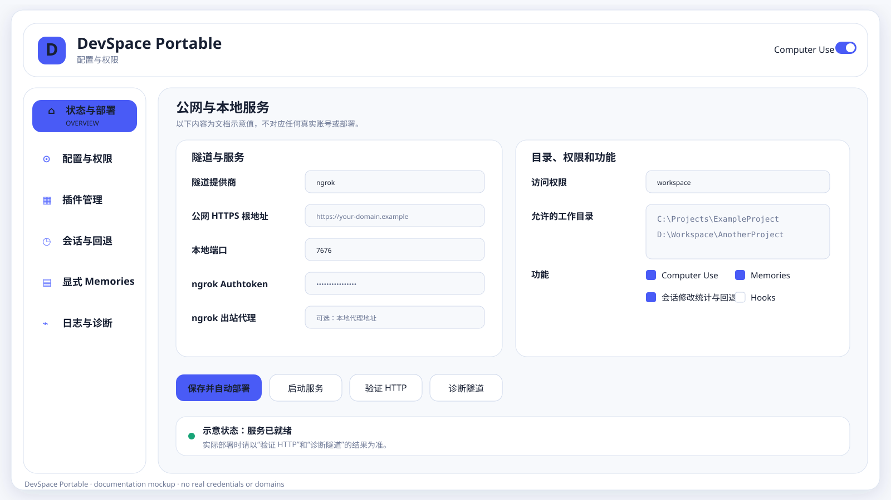
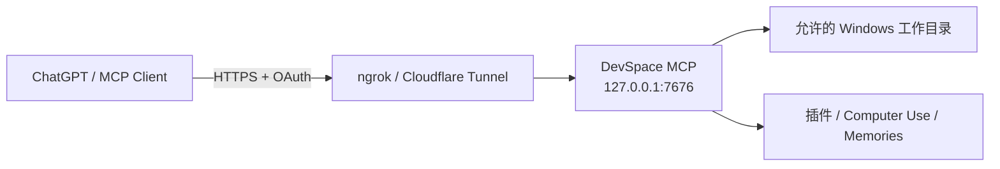

# DevSpace Deploy Portable

面向 Windows x64 的 DevSpace 便携部署、原生控制中心、Computer Use、插件管理、会话审阅与显式 Memories 集成项目。

当前稳定版本：**1.1.21**
Portable Protocol：**1.5**  
上游核心：[`Waishnav/devspace`](https://github.com/Waishnav/devspace) `1.0.5`

> 本仓库只维护源码、构建脚本、测试、文档和体积可控的 Portable 核心分支。Node、Git、cloudflared、ngrok、完整 `node_modules`、运行状态与发行 ZIP 不进入 Git 历史；完整 Windows 便携包发布在 GitHub Releases。



> 文档中的界面图只使用脱敏示意数据，不展示真实公网域名、Token、Owner Password、本机用户名或实际项目路径。

控制中心左侧主要页面分别用于：**状态与部署**（服务/隧道/更新/诊断）、**配置与权限**（公网域名、Token、工作目录和权限）、**插件管理**、**会话与回退**、**显式 Memories**、**日志与诊断**；右上角的 Computer Use 开关只控制桌面操作能力，不会替代目录/命令权限配置。

## 这个项目是做什么的

DevSpace Portable 的目标是把一台 Windows 电脑上的本地项目目录，通过受控的 MCP 服务暴露给 ChatGPT/Codex 使用，同时尽量把部署、隧道、OAuth、权限、插件、Computer Use、会话审阅和更新整合到一个原生 Windows 控制中心里。

典型链路如下：



默认情况下，ChatGPT **不会直接连接 `127.0.0.1`**。你需要先用 ngrok 或 Cloudflare Tunnel 给本机 DevSpace 提供一个公网 HTTPS 地址，再把这个地址的 `/mcp` 端点添加到 ChatGPT 的自定义 MCP App 中。

---

## 最快上手：使用 ngrok 部署

### 第 1 步：下载并解压 DevSpace Portable

进入本仓库的 [Releases](https://github.com/E3N-glotm/DevSpace-Deploy-Portable/releases) 页面，下载：

```text
DevSpacePortable-Windows-x64-1.1.21.zip
```

不要下载 GitHub 自动生成的 `Source code (zip)`，那只是源码，不能直接运行。

把 ZIP 解压到一个长期固定的位置，例如：

```text
D:\DevSpacePortable
```

然后运行：

```text
DevSpace-Portable.exe
```

建议不要把正式部署目录放在临时目录、浏览器下载缓存或会被自动清理的位置；在线更新、计划任务和日志都以这个解压目录作为 Portable 根目录。

### 第 2 步：注册 ngrok，并获取 Authtoken

DevSpace Portable 已经携带所需的 ngrok Agent，**不需要你另外安装 ngrok**，但你仍然需要一个自己的 ngrok 账号、Authtoken 和可用的 HTTPS 域名。

1. 打开 [ngrok Dashboard](https://dashboard.ngrok.com/) 并注册/登录账号。
2. 打开 [Your Authtoken](https://dashboard.ngrok.com/get-started/your-authtoken)，复制页面中的 **Authtoken**。
3. 打开 Dashboard 的 [Domains](https://dashboard.ngrok.com/domains) 页面，找到分配给当前账号的 Development Domain。

当前 ngrok Free 方案会为账号自动分配 1 个 Development Domain，例如：

```text
https://example-name.ngrok-free.app
```

Free 方案的这个 Development Domain 可以长期重复使用，但域名名称由 ngrok 自动分配，不能自由指定；自定义 ngrok 域名或自有域名需要使用支持相应域名能力的付费方案。ngrok 当前 Free 方案说明见 [Free Plan Limits](https://ngrok.com/docs/pricing-limits/free-plan-limits)。

> **Authtoken 和域名必须属于同一个 ngrok 账号。** 如果复制了 A 账号的 Authtoken，却填写 B 账号的域名，DevSpace 的隧道健康检查会失败。

### 第 3 步：在 DevSpace Portable 中填写配置

打开左侧 **“配置与权限”** 页面。使用 ngrok 时，最常用的配置如下：

| UI 字段 | 应该填写什么 | 示例 / 说明 |
| --- | --- | --- |
| 隧道提供商 | `ngrok` | 使用 ngrok 时选择它 |
| 公网 HTTPS 根地址 | ngrok 分配给你的 HTTPS 域名 | `https://example-name.ngrok-free.app` |
| 本地端口 | 一般保持 `7676` | 必须是 `1024-65535` 的空闲端口 |
| 工具模式 | 通常选 `full` | `full` 暴露完整 DevSpace 工具；`codex`/`minimal` 用于更受限场景 |
| ngrok Authtoken | 从 ngrok Dashboard 复制的 Token | 首次必须填写；以后留空会保留已保存 Token |
| ngrok 出站代理 | 没有代理就留空 | 可填 `http://127.0.0.1:7890`、`https://...` 或 `socks5://...` |
| VPN/代理兼容模式 | 推荐保持开启 | EasyConnect/Sangfor 协商时暂缓 tunnel；检测到健康本地系统代理时让 tunnel 跟随代理出站 |
| 使用 Windows 根证书 | 通常关闭 | 企业代理/自签根证书环境出现 TLS 问题时再考虑开启 |
| Cloudflare Tunnel Token | 使用 ngrok 时留空 | 只在 Cloudflare 模式使用 |
| 访问权限 | 推荐先用 `workspace` | `full-access` 权限很大，只在明确需要时启用 |
| 允许的工作目录 | 每行一个真实存在的目录 | 例如 `E:\program\Python\MyProject` |
| 开放当前全部盘符根目录 | 默认不要开启 | 开启后会把当前固定盘根目录作为 allowed roots |
| Owner Password | 可自定义，也可留空 | 首次留空时 DevSpace 自动生成，必须保存好 |

**“公网 HTTPS 根地址”只填写 origin，不要手动加 `/mcp`。** 正确：

```text
https://example-name.ngrok-free.app
```

错误：

```text
https://example-name.ngrok-free.app/mcp
```

DevSpace 会自动生成真正的 MCP 地址：

```text
https://example-name.ngrok-free.app/mcp
```

### 第 4 步：选择权限和功能

第一次部署建议先使用：

```text
访问权限：workspace
允许的工作目录：只填写你准备让 ChatGPT 操作的项目目录
Computer Use：按需开启
显式 Memories：按需开启
生命周期 Hooks：按需开启
会话修改统计与回退：建议开启
```

如果选择 `custom`，可以分别控制：工作区外路径、任意命令、Shell 修改、网络/SSH、凭据接口、Computer Use、交互式进程和持续进程。

`full-access` 是面向高级用户的高权限配置，它仍然受当前 Windows 用户、ACL、UAC、防病毒软件和远端系统权限约束，但允许 DevSpace 在当前用户可访问范围内执行更多操作。公共部署或不可信环境不建议直接启用。

### 第 5 步：保存并自动部署

配置完成后点击：

```text
保存并自动部署
```

首次部署会完成配置写入、计划任务安装、本地 MCP 服务启动、隧道启动和健康检查。成功后，状态页应能看到：

```text
Local URL : http://127.0.0.1:7676
Public URL: https://你的域名
MCP URL   : https://你的域名/mcp
```

如果首次没有填写 Owner Password，DevSpace 会弹窗显示自动生成的 Owner Password。**立即保存到密码管理器**；ChatGPT 第一次 OAuth 授权时会用到它。

可以在“状态与部署”页面进一步执行 HTTP 验证、隧道诊断、文件验证或查看日志。如果公网地址不可达，先检查：Authtoken 是否正确、域名是否属于同一账号、本地端口是否被占用，以及代理配置是否正确。

### 第 6 步：在 ChatGPT 网页端添加 DevSpace

ChatGPT 的自定义 MCP/App 功能会随套餐、工作区角色和产品版本变化。以当前官方文档为准：需要先启用可用的 Developer Mode / 自定义 App 能力，然后在 **Settings → Apps** 或工作区 **Apps → Create** 中创建自定义 MCP App。官方说明见 [Developer mode and MCP apps in ChatGPT](https://help.openai.com/en/articles/12584461-developer-mode-and-full-mcp-connectors-in-chatgpt)。

创建时重点填写：

| ChatGPT 网页字段 | 填写内容 |
| --- | --- |
| App 名称 | 例如 `DevSpace MCP` |
| MCP Server / Endpoint | `https://你的-ngrok-域名/mcp` |
| Authentication | 使用服务器提供的 OAuth 流程 / 按页面自动发现 |

然后执行 **Scan Tools / 扫描工具**。ChatGPT 会读取 DevSpace 暴露的 OAuth metadata 和 MCP 工具定义。

第一次授权时浏览器会打开 DevSpace 自己的 **Connect DevSpace** 页面，其中会显示 Client、Scope 和 Resource，并要求输入：

```text
Owner password
```

这里输入的是 DevSpace UI 中保存或自动生成的 **Owner Password**，不是 ngrok Authtoken。点击 **Authorize DevSpace** 后，OAuth 完成，ChatGPT 才能取得 MCP 访问令牌。

> **不要把 ngrok Authtoken 填进 ChatGPT。** ngrok Authtoken 只应该保存在本机 DevSpace 配置中；ChatGPT 连接阶段只需要公网 MCP URL，并通过 DevSpace OAuth 页面完成 Owner Password 授权。

### 第 7 步：在聊天中使用

连接成功后，新开一个聊天并选择 DevSpace App，或者在支持 App/MCP 引用的界面中直接调用它。例如：

```text
用 DevSpace 打开 E:\program\Python\MyProject，检查 Git 状态和项目结构。
```

```text
只在这个项目目录里修改 README，完成后给我看 diff，不要动其他目录。
```

```text
检查当前 DevSpace 可以访问哪些工作目录和权限，不要做任何修改。
```

如果升级后顶层 MCP 工具 Schema 发生变化，需要在 ChatGPT App 管理页面执行 Refresh / Scan Tools；如果当前 UI 没有刷新入口，可以删除后使用同一个 `/mcp` URL 重新创建 App。1.1.21 没有修改 Portable Protocol 或顶层 MCP Schema，因此从 1.1.20 升级不要求重复 OAuth 或重新 Scan Tools。

---

## ngrok 网页端到底需要做什么

如果只使用 DevSpace Portable 的标准 ngrok 模式，ngrok 网页端实际只需要完成三件事：

1. **注册账号**；
2. **复制 Authtoken**；
3. **查看账号的 Development Domain**。

不需要在 ngrok Dashboard 手工创建一个指向 `7676` 的网页应用，也不需要自己执行 `ngrok http 7676`。DevSpace 会使用本地保存的 Authtoken、你填写的公网域名和本地端口自动启动 Agent，并检查该域名是否真的映射到本机 DevSpace MCP。

ngrok Free 方案可能对普通浏览器 HTML 流量显示中间提示页，但 ngrok 官方说明该提示页不影响 API/程序化访问，因此不会要求 ChatGPT 手工点击提示页。

## 配置示例

假设 ngrok Dashboard 显示：

```text
Development Domain:
https://albatross-example.ngrok-free.app

Authtoken:
2abcDEF...你的真实Token
```

DevSpace UI 中填写：

```text
隧道提供商：ngrok
公网 HTTPS 根地址：https://albatross-example.ngrok-free.app
本地端口：7676
工具模式：full
ngrok Authtoken：2abcDEF...你的真实Token
允许的工作目录：E:\program\Python\MyProject
访问权限：workspace
Owner Password：留空自动生成，或填写一个至少 16 字符的密码
```

ChatGPT 网页端填写：

```text
MCP Endpoint:
https://albatross-example.ngrok-free.app/mcp
```

第一次 OAuth 页面再输入 Owner Password 即可。

## 常见问题

### 1. `Public URL must be the origin only, without /mcp`

说明你在 DevSpace UI 的“公网 HTTPS 根地址”里写了 `/mcp`。删掉路径，只保留：

```text
https://xxxxx.ngrok-free.app
```

### 2. ngrok 启动了，但 DevSpace 提示域名不匹配

检查当前填写的 Development Domain 与 Authtoken 是否属于同一个 ngrok 账号。如果切换过账号，旧 Token 和新域名混用会导致 DevSpace 拒绝把隧道判定为健康。

### 3. 浏览器直接访问 `/mcp` 返回 401

未经过 OAuth 的请求返回 401 是正常现象。DevSpace 会额外检查下面两个 metadata 地址是否返回成功：

```text
https://你的域名/.well-known/oauth-protected-resource/mcp
https://你的域名/.well-known/oauth-authorization-server
```

ChatGPT 会通过这些 metadata 自动发现 OAuth 流程。

### 4. `基础连接已经关闭: 发送时发生错误`

1.1.19 将更新下载改为 **curl 优先、代理异常自动直连、断点续传和实时进度**。UI 会持续显示已下载字节、百分比、速度、预计剩余时间和当前网络路径；连接长时间没有有效数据会有界失败并切换路径，不再让 PowerShell 网络请求长时间无反馈等待。

更新器只读取当前进程继承的网络环境，**不会启动、停止、重启或修改 EasyConnect、v2rayN、Windows WinINET/WinHTTP 代理设置**。如果代理不可用，会只对当前 GitHub 请求使用 `curl --noproxy '*'` 直连重试。

### 5. 使用本地代理

“ngrok 出站代理”支持：

```text
http://host:port
https://host:port
socks5://host:port
```

不要把代理用户名/密码直接写进 URL。

### 6. ChatGPT 扫描不到工具

先确认公网 OAuth metadata 正常，再检查 ChatGPT 当前账号/工作区是否具有自定义 App/MCP 能力。产品入口和权限可能变化，应以 OpenAI 当前官方文档为准。创建或刷新 App 时，MCP Endpoint 必须是完整的：

```text
https://你的域名/mcp
```

## Release 文件说明

- 稳定版 ZIP：在本仓库的 **Releases** 页面下载 `DevSpacePortable-Windows-x64-<版本>.zip`。
- 每个 Release 同时提供 `update-manifest.json` 与 `SHA256SUMS-release.txt`，用于更新检查和完整性校验。
- 不要下载 GitHub 自动生成的 Source code ZIP 作为可运行程序；该压缩包只包含源码。

## 1.1.21 主要变化

- 新增默认开启的 **“VPN/代理兼容模式（推荐）”**。它只管理 DevSpace 自己的公网 tunnel，不修改 Windows 系统代理、WinHTTP、路由表、网卡或第三方 VPN/代理进程；
- 当检测到 EasyConnect/Sangfor 正在建立 VPN、但其虚拟网卡尚未真正连通时，DevSpace 会暂时挂起 ngrok，避免 ngrok 的长连接在 VPN 登录/路由切换窗口内与客户端竞争网络状态；VPN 建立后再等待一个短暂稳定期并恢复 tunnel；
- 当 Windows 当前启用了可用的本地 HTTP/SOCKS 代理（例如 v2rayN 的本地监听）时，DevSpace tunnel 会跟随该代理出站，而不是强制绕过代理直连公网；代理退出或网络路径变化时，只重建 DevSpace 自己的 tunnel 子进程；
- tunnel 运行状态新增 `Network mode / VPN state / Network reason / Proxy source / Tunnel supervisor PID`，方便区分“公网 tunnel 暂停等待 VPN”与真正的服务故障；
- 新增网络共存回归，验证代理跟随、Sangfor 协商期暂停、VPN 稳定后恢复，以及整个过程不会修改 WinINET 代理注册表；
- 继续继承 1.1.20 的启动期第三方 PID 保护、1.1.19 的严格停止与可观测更新机制；Portable Protocol 仍为 1.5。

> 如果你需要完全固定的 tunnel 网络路径，可以关闭“VPN/代理兼容模式”，或在“ngrok 出站代理”里显式填写一个稳定代理。默认兼容模式更适合 EasyConnect、v2rayN 与 DevSpace 需要同时运行的 Windows 主机。

完整历史见 [CHANGELOG.md](CHANGELOG.md) 和 [`docs/releases/`](docs/releases/)。

## 1.1.20 主要变化

- 修复一个发生在**打开原生控制中心**时的高风险 PID 复用问题：旧的 Computer Use Broker 状态文件可能保存已经退出的 broker PID，而 Windows 后续可能把同一个 PID 分配给 EasyConnect、v2rayN 或其他程序；旧代码在打开 UI、切换租约或确认 Computer Use 使用原生队列时会直接按记录 PID 执行 `taskkill`，因此存在打开 DevSpace 就误终止第三方程序的可能；
- `stopComputerUseBroker()` 现在必须同时验证 PID、Portable 自有 `node.exe` 路径、`computer-use-broker.cjs` 完整脚本路径和对应 leaseId，四项身份不能同时确认时只删除陈旧 broker 记录，绝不结束该 PID；
- 新增 `test-ui-open-process-safety.mjs`：人为把一个仍在运行的系统 `PING.EXE` PID 写入陈旧 broker 状态，再执行 `ui-open` 和 `ui-close`，验收条件是外部进程必须全过程存活而陈旧状态被清理；
- 实机只读检查显示当前 DevSpace/ngrok、v2rayN/sing-box 与 Sangfor ECAgent 可以同时存在，监听端口分别为 `7676/4040`、`10809/10815` 和 `10000`，没有发现直接端口占用重叠；因此本次修复重点是启动期陈旧 PID 误杀，而不是修改 Windows 路由、系统代理或 EasyConnect/v2rayN 配置；
- 继承 1.1.19 的 curl-first 更新、非递归 Portable 停止、严格 shutdown 与事务回滚，Portable Protocol 仍为 1.5。

完整历史见 [CHANGELOG.md](CHANGELOG.md) 和 [`docs/releases/`](docs/releases/)。

## 1.1.19 主要变化

- GitHub 在线更新改为 `curl.exe` 优先，先使用当前网络/代理环境，连接失败后对该请求自动使用 `--noproxy '*'` 直连；仅保留一次短时 PowerShell 兼容回退，不再执行多轮长超时 PowerShell 下载；
- 下载支持 partial file 断点续传、低速超时检测和实时 `update-progress.json`；原生 UI 每 500 ms 展示进度、下载量、速度、ETA 与当前网络路径；
- 更新器明确不控制 EasyConnect、v2rayN 或 Windows 系统代理，网络 fallback 只作用于更新器自己的 GitHub 请求；
- 修复 Portable 停止流程递归 `taskkill /T` 可能误杀由 DevSpace 启动、但并不属于 Portable 的第三方子进程的问题；现在只终止自身可执行路径或命令行明确属于当前 Portable 根目录的 PID，并按自身进程层级从叶到根清理；
- “停止全部并退出”改用终止态 `shutdown`，现有计划任务保持禁用；“卸载计划任务”删除任务后再做一次严格的 Portable 自有 PID 清理，如果仍有后台进程则直接报错，不再错误声称已经退出；
- 保持 `file-delta-v1` 增量优先、完整 ZIP 自动兜底和事务回滚，Portable Protocol 仍为 1.5。

完整历史见 [CHANGELOG.md](CHANGELOG.md) 和 [`docs/releases/`](docs/releases/)。

## 1.1.18 主要变化

- 显式 Memories 默认只显示“当前所选工作区 + 全局”记忆，其他工作区不会再混入默认列表；
- Memories 页面新增“查看工作区”和“显示其他工作区”，需要跨项目检查时再显式开启；
- Memory 列表明确区分“当前工作区 / 全局 / 其他工作区”，并显示绑定工作区；
- 选择任意 Memory 后，右侧“完整内容预览”会显示完整正文、作用域、工作区、标签与更新时间；
- 更新协议继续兼容 1.1.16/1.1.17 的 `file-delta-v1`：精确版本增量优先，任一预检失败时自动下载完整 Portable ZIP；Portable Protocol 仍为 1.5。

完整历史见 [CHANGELOG.md](CHANGELOG.md) 和 [`docs/releases/`](docs/releases/)。

## 1.1.17 主要变化

- 完整 Release ZIP 在首次启动前就直接包含 `data/plugins/installed/codex-runtime-bridge/<版本>/`，包括 `manifest.json`、`runtime.mjs`、`keep-awake.ps1` 和 Skill；该目录就是 PluginManager 的实际安装目录，不再额外生成根目录 `plugins/`；
- 构建时从维护源 `setup/bundled-plugins/` 通过虚拟归档映射写入最终 ZIP 的 `data/plugins/installed/`，不会复制维护机本地 `data/` 中的 OAuth、SQLite、配置或其他插件状态；
- 运行时仍以 `data/plugins/installed/` 作为 PluginManager 的实际插件目录；`setup/bundled-plugins/` 只作为受控的 bundled plugin 来源和缺失恢复来源；
- 修复 Windows PowerShell 5.1 经本地代理访问 GitHub 时偶发“基础连接已经关闭”的问题：显式启用 TLS 1.2，PowerShell 网络请求最多重试 3 次，仍失败则自动切换 `curl.exe`；Release API、更新清单、增量包和完整包下载都使用同一套有界 fallback；
- 继续继承 1.1.16 的“增量优先、完整包兜底”、严格逐文件 Diff 与现代字体行为，Portable Protocol 仍为 1.5。

完整历史见 [CHANGELOG.md](CHANGELOG.md) 和 [`docs/releases/`](docs/releases/)。

## 仓库结构

```text
app/                       Portable Node 应用入口、锁文件和插件调度器
vendor/waishnav-devspace/  受控的 DevSpace 1.0.5 Portable 核心包
setup/                     原生 WinForms、部署、隧道、测试和发行脚本
scripts/                   开发引导、核心打包、运行时恢复和仓库检查
docs/releases/             每个版本的完整 HOTFIX 更新说明
docs/acceptance/            历史验收记录
.github/workflows/         CI 与标签发行流程
```

`app/node_modules` 不是源码，不提交。当前 Portable 核心的可维护副本位于 `vendor/waishnav-devspace`；构建前由脚本将其打包为 `packages/waishnav-devspace-1.0.5.tgz`，再按 `app/package-lock.json` 安装。

## 开发环境

需要：

- Windows 10/11 x64；
- Node.js `>=22.19 <27`；
- Python 3.11+；
- Git；
- 维护 Release 时需要 GitHub CLI，可通过 `winget install --id GitHub.cli --exact --scope user` 安装；
- 构建原生 UI 时需要 Visual Studio Build Tools 和 .NET Framework 4.8 引用程序集。

首次克隆后执行：

```powershell
PowerShell -NoProfile -ExecutionPolicy Bypass -File scripts/bootstrap-dev.ps1
```

该脚本会：

1. 将 `vendor/waishnav-devspace` 打包到被 Git 忽略的 `packages/`；
2. 依据锁文件安装 `app/node_modules`；
3. 执行依赖加固与源码树检查；
4. 在本机具备 Build Tools 时编译 `DevSpace-Portable.exe`。

完整说明见 [docs/DEVELOPMENT.md](docs/DEVELOPMENT.md)。

## 从 Release 恢复便携运行时

源码仓库不保存约 579 MiB 的 `runtime/`。需要构建完整 Portable ZIP 时，可从已有 Release 恢复固定运行时：

```powershell
PowerShell -NoProfile -ExecutionPolicy Bypass -File scripts/hydrate-runtime-from-release.ps1 -Version 1.1.21
```

脚本只从 Release ZIP 提取 `runtime/`，不会复制其中的用户配置、OAuth 数据、日志或 `data/`。

## 测试

```powershell
npm run source:verify
npm run core:pack
PowerShell -NoProfile -ExecutionPolicy Bypass -File scripts/test-source.ps1
```

CI 在 Windows runner 上执行源码边界检查、核心包打包、锁文件安装、原生 UI 编译、会话/Memory/插件回归和生产依赖审计。

## 发布

版本说明放在：

```text
docs/releases/HOTFIX-<版本>.md
```

创建并推送 `v<版本>` 标签后，Release workflow 会从上一稳定 Release 恢复运行时，重新安装依赖、执行测试、构建 ZIP、生成更新清单，并上传到 GitHub Release。详细流程见 [docs/RELEASING.md](docs/RELEASING.md)。

需要从维护机手工创建或覆盖 Release 附件时，可运行：

```powershell
PowerShell -NoProfile -ExecutionPolicy Bypass -File scripts/publish-github-release.ps1 -Version 1.1.21 -BypassProxy
```

## 在线更新

正式 Release 解压目录可在原生 UI 的“状态与部署”页面点击“检查更新”。从 1.1.16 开始，程序先寻找 `fromVersion` 与当前安装版本完全一致的 `file-delta-v1` 增量包；增量包会先验证下载大小、SHA-256、压缩路径、变更文件目标哈希以及当前基础文件哈希。只要增量路径不适用或任一预检失败，就自动改用完整 Portable ZIP。1.1.19 进一步加入实时下载进度、速度/ETA、断点续传、低速失败检测和 per-request 直连 fallback；这些网络策略不会修改系统代理或第三方 VPN/代理软件。安装阶段继续使用同盘备份和事务回滚，`data/`、`logs/`、`reports/` 始终保留。

源码检出目录包含 `.git` 时，应用级在线更新会拒绝覆盖，请继续使用 Git 分支和 Pull Request 更新源码。当前更新器实现与后续签名、版本目录方案见 [docs/UPDATE-DESIGN.md](docs/UPDATE-DESIGN.md)。

## 安全与隐私

以下内容绝不能提交或上传为 Release 源文件：

- `data/config/auth.json`、`ngrok.yml`、`cloudflare.token`；
- `data/state/devspace.sqlite` 及 OAuth Token；
- `logs/`、`reports/`、Computer Use 临时请求；
- 已部署目录的完整副本。

提交前运行 `npm run source:verify`。安全边界和漏洞报告方式见 [SECURITY.md](SECURITY.md)。

## 许可证与第三方组件

本仓库原创 Portable 集成代码采用 MIT License。DevSpace 上游代码保留其 MIT License；Node.js、Git for Windows、cloudflared、npm 依赖等保留各自许可证。

**ngrok Agent 为专有软件。** 当前公开 Release 仍包含固定版本的内部便携运行时；继续公开分发前应确认具体再分发方式符合 ngrok 当前条款，或改为用户首次启用时从官方来源下载并校验。详情见 [THIRD-PARTY-NOTICES.md](THIRD-PARTY-NOTICES.md)。

## 参与维护

请通过分支和 Pull Request 提交修改，不要直接向 `main` 强推。开发、测试、版本号、更新日志和 Release 规则见 [CONTRIBUTING.md](CONTRIBUTING.md)。

