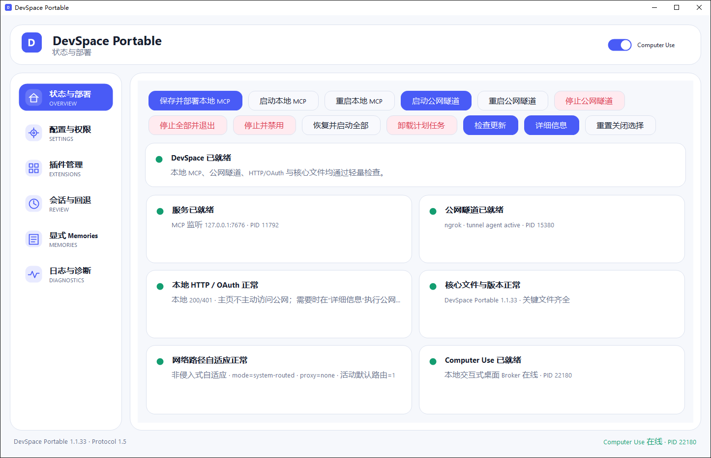
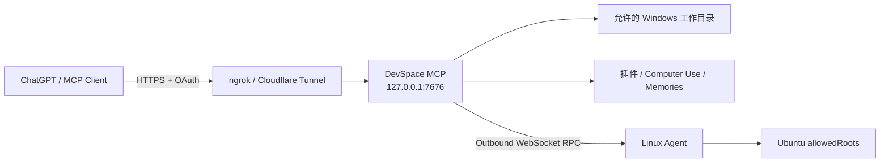

# DevSpace Deploy Portable

面向 Windows x64 的 DevSpace 便携部署、原生控制中心、Computer Use、插件管理、会话审阅与显式 Memories 集成项目。

当前稳定版本：**1.1.48**
Portable Protocol：**1.5**  
上游核心基线：[`Waishnav/devspace`](https://github.com/Waishnav/devspace) `1.0.7`（选择性同步，不覆盖 Portable 扩展）

> 本仓库只维护源码、构建脚本、测试、文档和体积可控的 Portable 核心分支。Node、Git、cloudflared、ngrok、完整 `node_modules`、运行状态与发行 ZIP 不进入 Git 历史；完整 Windows 便携包发布在 GitHub Releases。



> 上图为 DevSpace Portable Windows 原生控制中心的实际界面截图；公开文档中的截图不展示 Token、Owner Password 等敏感认证信息。

控制中心左侧主要页面分别用于：**状态与部署**（服务/隧道/更新/诊断）、**配置与权限**（公网域名、Token、工作目录和权限）、**远程服务器**（Linux Agent、SSH 救援与安装）、**插件管理**、**续轮任务**（Continuation 状态、Owner 锁、手动结束/恢复）、**会话与回退**、**显式 Memories**、**日志与诊断**；右上角的 Computer Use 开关只控制桌面操作能力，不会替代目录/命令权限配置。

## 这个项目是做什么的

DevSpace Portable 的目标是把一台 Windows 电脑上的本地项目目录，通过受控的 MCP 服务暴露给 ChatGPT/Codex 使用，同时尽量把部署、隧道、OAuth、权限、插件、Computer Use、会话审阅和更新整合到一个原生 Windows 控制中心里。

典型链路如下：



默认情况下，ChatGPT **不会直接连接 `127.0.0.1`**。你需要先用 ngrok 或 Cloudflare Tunnel 给本机 DevSpace 提供一个公网 HTTPS 地址，再把这个地址的 `/mcp` 端点添加到 ChatGPT 的自定义 MCP App 中。

---

## 最快上手：使用 ngrok 部署

### 第 1 步：下载并解压 DevSpace Portable

进入本仓库的 [Releases](https://github.com/E3N-glotm/DevSpace-Deploy-Portable/releases) 页面，下载：

```text
DevSpacePortable-Windows-x64-1.1.48.zip
```

不要下载 GitHub 自动生成的 `Source code (zip)`，那只是源码，不能直接运行。

把 ZIP 解压到一个长期固定的位置，例如：

```text
D:\DevSpacePortable
```

然后运行：

```text
DevSpace-Portable.exe
```

建议不要把正式部署目录放在临时目录、浏览器下载缓存或会被自动清理的位置；在线更新、计划任务和日志都以这个解压目录作为 Portable 根目录。

### 第 2 步：注册 ngrok，并获取 Authtoken

DevSpace Portable 已经携带所需的 ngrok Agent，**不需要你另外安装 ngrok**，但你仍然需要一个自己的 ngrok 账号、Authtoken 和可用的 HTTPS 域名。

1. 打开 [ngrok Dashboard](https://dashboard.ngrok.com/) 并注册/登录账号。
2. 打开 [Your Authtoken](https://dashboard.ngrok.com/get-started/your-authtoken)，复制页面中的 **Authtoken**。
3. 打开 Dashboard 的 [Domains](https://dashboard.ngrok.com/domains) 页面，找到分配给当前账号的 Development Domain。

当前 ngrok Free 方案会为账号自动分配 1 个 Development Domain，例如：

```text
https://example-name.ngrok-free.app
```

Free 方案的这个 Development Domain 可以长期重复使用，但域名名称由 ngrok 自动分配，不能自由指定；自定义 ngrok 域名或自有域名需要使用支持相应域名能力的付费方案。ngrok 当前 Free 方案说明见 [Free Plan Limits](https://ngrok.com/docs/pricing-limits/free-plan-limits)。

> **Authtoken 和域名必须属于同一个 ngrok 账号。** 如果复制了 A 账号的 Authtoken，却填写 B 账号的域名，DevSpace 的隧道健康检查会失败。

### 第 3 步：在 DevSpace Portable 中填写配置

打开左侧 **“配置与权限”** 页面。使用 ngrok 时，最常用的配置如下：

| UI 字段 | 应该填写什么 | 示例 / 说明 |
| --- | --- | --- |
| 隧道提供商 | `ngrok` | 使用 ngrok 时选择它 |
| 公网 HTTPS 根地址 | ngrok 分配给你的 HTTPS 域名 | `https://example-name.ngrok-free.app` |
| 本地端口 | 一般保持 `7676` | 必须是 `1024-65535` 的空闲端口 |
| 工具模式 | 通常选 `full` | `full` 暴露完整 DevSpace 工具；`codex`/`minimal` 用于更受限场景 |
| ngrok Authtoken | 从 ngrok Dashboard 复制的 Token | 首次必须填写；以后留空会保留已保存 Token |
| ngrok 出站代理 | 没有代理就留空 | 只有账号支持 ngrok agent proxy 时才填写；部分免费账号会返回 `ERR_NGROK_9009` |
| 公网隧道网络自适应 | 推荐保持开启 | 不识别具体 VPN/TUN 软件；网卡、地址或路由变化时仅静默 DevSpace 自有公网隧道，连续稳定 15 秒后恢复，本地 MCP 不停止 |
| 使用 Windows 根证书 | 通常关闭 | 企业代理/自签根证书环境出现 TLS 问题时再考虑开启 |
| Cloudflare Tunnel Token | 使用 ngrok 时留空 | 只在 Cloudflare 模式使用 |
| 访问权限 | 推荐先用 `workspace` | `full-access` 权限很大，只在明确需要时启用 |
| 允许的工作目录 | 每行一个真实存在的目录 | 例如 `E:\program\Python\MyProject` |
| 开放当前全部盘符根目录 | 默认不要开启 | 开启后会把当前固定盘根目录作为 allowed roots |
| Owner Password | 可自定义，也可留空 | 首次留空时 DevSpace 自动生成，必须保存好 |

**“公网 HTTPS 根地址”只填写 origin，不要手动加 `/mcp`。** 正确：

```text
https://example-name.ngrok-free.app
```

错误：

```text
https://example-name.ngrok-free.app/mcp
```

DevSpace 会自动生成真正的 MCP 地址：

```text
https://example-name.ngrok-free.app/mcp
```

### 第 4 步：选择权限和功能

第一次部署建议先使用：

```text
访问权限：workspace
允许的工作目录：只填写你准备让 ChatGPT 操作的项目目录
Computer Use：按需开启
显式 Memories：按需开启
生命周期 Hooks：按需开启
会话修改统计与回退：建议开启
```

如果选择 `custom`，可以分别控制：工作区外路径、任意命令、Shell 修改、网络/SSH、凭据接口、Computer Use、交互式进程和持续进程。

`full-access` 是面向高级用户的高权限配置，它仍然受当前 Windows 用户、ACL、UAC、防病毒软件和远端系统权限约束，但允许 DevSpace 在当前用户可访问范围内执行更多操作。公共部署或不可信环境不建议直接启用。

### 第 5 步：保存并自动部署

配置完成后点击：

```text
保存并自动部署
```

首次部署会完成配置写入、计划任务安装、本地 MCP 服务启动、隧道启动和健康检查。成功后，状态页应能看到：

```text
Local URL : http://127.0.0.1:7676
Public URL: https://你的域名
MCP URL   : https://你的域名/mcp
```

如果首次没有填写 Owner Password，DevSpace 会弹窗显示自动生成的 Owner Password。**立即保存到密码管理器**；ChatGPT 第一次 OAuth 授权时会用到它。

可以在“状态与部署”页面进一步执行 HTTP 验证、隧道诊断、文件验证或查看日志。如果公网地址不可达，先检查：Authtoken 是否正确、域名是否属于同一账号、本地端口是否被占用，以及代理配置是否正确。

### 第 6 步：在 ChatGPT 网页端添加 DevSpace

ChatGPT 的自定义 MCP/App 功能会随套餐、工作区角色和产品版本变化。以当前官方文档为准：需要先启用可用的 Developer Mode / 自定义 App 能力，然后在 **Settings → Apps** 或工作区 **Apps → Create** 中创建自定义 MCP App。官方说明见 [Developer mode and MCP apps in ChatGPT](https://help.openai.com/en/articles/12584461-developer-mode-and-full-mcp-connectors-in-chatgpt)。

创建时重点填写：

| ChatGPT 网页字段 | 填写内容 |
| --- | --- |
| App 名称 | 例如 `DevSpace MCP` |
| MCP Server / Endpoint | `https://你的-ngrok-域名/mcp` |
| Authentication | 使用服务器提供的 OAuth 流程 / 按页面自动发现 |

然后执行 **Scan Tools / 扫描工具**。ChatGPT 会读取 DevSpace 暴露的 OAuth metadata 和 MCP 工具定义。

第一次授权时浏览器会打开 DevSpace 自己的 **Connect DevSpace** 页面，其中会显示 Client、Scope 和 Resource，并要求输入：

```text
Owner password
```

这里输入的是 DevSpace UI 中保存或自动生成的 **Owner Password**，不是 ngrok Authtoken。点击 **Authorize DevSpace** 后，OAuth 完成，ChatGPT 才能取得 MCP 访问令牌。

> **不要把 ngrok Authtoken 填进 ChatGPT。** ngrok Authtoken 只应该保存在本机 DevSpace 配置中；ChatGPT 连接阶段只需要公网 MCP URL，并通过 DevSpace OAuth 页面完成 Owner Password 授权。

### 第 7 步：在聊天中使用

连接成功后，新开一个聊天并选择 DevSpace App，或者在支持 App/MCP 引用的界面中直接调用它。例如：

```text
用 DevSpace 打开 E:\program\Python\MyProject，检查 Git 状态和项目结构。
```

```text
只在这个项目目录里修改 README，完成后给我看 diff，不要动其他目录。
```

```text
检查当前 DevSpace 可以访问哪些工作目录和权限，不要做任何修改。
```

如果升级后顶层 MCP 工具 Schema 发生变化，需要在 ChatGPT App 管理页面执行 Refresh / Scan Tools；如果当前 UI 没有刷新入口，可以删除后使用同一个 `/mcp` URL 重新创建 App。**1.1.40 新增 `read_attachment` 原生图片/PDF附件工具，因此升级后应重新 Refresh / Scan Tools。** Portable Protocol 仍为 1.5，现有 OAuth 客户端身份本身不需要重建。

## Linux Remote Workspace

1.1.39 起，Windows DevSpace 可以继续作为唯一 MCP/OAuth Control Plane，同时把一台或多台 Ubuntu/Linux 服务器登记为远程 Workspace Backend。Linux 主机不需要暴露新的 MCP 服务；它只运行一个依赖 Python 标准库的轻量 Agent，并主动连接回当前 DevSpace 的 `/agent/v1/connect` WebSocket。1.1.40 额外提供可选 SSH 救援通道：SSH 只用于离线 Agent 的启动/安装，不承载正常 Remote Workspace 文件和命令流量。

在 **配置与权限 → 远程服务器 / Linux Agent** 中填写服务器显示名和允许访问的 Linux 父目录，例如：

```text
服务器：gpu-01
allowedRoots：/home/ubuntu/workspace
```

点击 **生成一次性安装命令**，把生成的命令复制到目标 Ubuntu 执行。**默认命令不再使用 sudo**：普通 Linux 账号直接安装到 `${XDG_STATE_HOME:-$HOME/.local/state}/devspace-agent` 并以该账号运行；如果之前的 1.1.39 已创建 `/var/lib/devspace-agent` 且该目录现在归当前账号可写，则自动复用旧目录原位升级，不会再启动一份重复 Agent。只有管理员显式用 sudo/root 运行 installer 时才进入系统级 `/var/lib` + systemd 路径。命令会先校验 installer SHA-256，再由 installer 校验 Agent SHA-256。Enrollment Token 默认 15 分钟有效；首次握手开始后，在 Linux 尚未确认已持久化 Agent 凭据前保留最多 2 分钟恢复窗口。若公网 ACK 在这段时间内丢失，Agent 会自动重试并复用同一 Agent ID，同时控制端轮换新的 Agent Secret；Linux 原子保存凭据并确认后 Token 立即失效。没有 systemd 服务条件时使用普通用户 `nohup` 后台模式并保存 PID/日志；该模式可跨正常 SSH 退出保持连接，但主机/容器重启后若没有用户级 init 机制，需要重新启动 Agent。1.1.40 的同一页面可以保存 SSH 主机、端口、用户名和可选密码，然后点击 **一键恢复 / 安装 Agent**；客户端优先拉起原有 Agent 身份，服务器确实未安装时才重新 enrollment。密码使用 Windows 当前用户 DPAPI 加密保存，不写入 SSH 参数或远程命令。可选的自动 SSH 恢复在控制中心缩到托盘时仍会限频检查离线 Agent。原来的手动安装命令始终保留为最终 fallback。

之后可以直接让 MCP 打开：

```text
devspace://gpu-01/home/ubuntu/workspace/MyProject
```

也可以使用 Agent ID 代替显示名。`open_workspace` 返回远程 backend、Agent/主机信息和可用的 GPU 状态；后续 `read`、`write/edit/apply_patch`、grep/glob/ls、`exec_command`、PTY/持续进程、file watch、`show_changes`、`session_rollback` 等继续复用同一个 `workspaceId`，不需要另外创建 SSH/SFTP 会话。

远程结构化文件访问始终再次经过 Agent `allowedRoots` 和真实路径校验；命令执行还受 DevSpace 权限规则、Agent 运行用户权限及 Linux 自身权限约束。systemd 模式额外使用 unit sandbox；非 systemd 后台模式没有 systemd sandbox，但仍保留 allowedRoots、真实路径校验和普通用户权限边界。大文件采用 512 KiB 分块、每块和整文件 SHA-256、gzip 可选压缩与 delta chunk 复用。短暂断线时，尚未发送的 RPC 可以有界等待重连；已经发送但结果未知的写操作不会被自动重放，避免重复修改。

远程会话审阅继续使用 Windows 侧有界 `sparse-journal-v4`，不会在服务器再复制一套 review 仓库。结构化修改的 baseline、历史 diff、回退前安全快照仍受每会话 32 MiB / 总计 512 MiB 上限约束；任意 shell 副作用仍只声明 `tracked-paths-only`。控制中心可以查看远程历史，但真正的远程 rollback / safety restore 必须由当前在线 MCP 会话通过已认证 Agent 执行。

## Gemini、Claude 和其它 MCP 客户端

DevSpace Portable 的公网 MCP/OAuth 层不绑定 ChatGPT。1.1.35 起，支持标准 OAuth Dynamic Client Registration 的客户端可以使用任意安全的 HTTPS 回调地址自动注册；本机原生客户端也支持 loopback HTTP(S) 与符合反向域名格式的 private URI scheme。

如果 Gemini、Claude、IDE 或其它客户端提示“服务器不能自动注册 OAuth 客户端”，打开 DevSpace **配置与权限 → AI / MCP OAuth 客户端**。1.1.39 重打包版已把“创建手动客户端”和“选中客户端凭据”拆开；左侧现有 ChatGPT/DCR 记录不会再覆盖右侧的新建表单：

1. 从目标 AI 客户端复制它显示的 Redirect URI；
2. 在 DevSpace 中创建一个手动 OAuth 客户端；
3. 将生成的 Client ID 和本次显示的 Client Secret 填回目标客户端；
4. 继续 OAuth，在 DevSpace Owner Password 页面核对 Client、Resource 和 Redirect URI 后授权。

Client Secret 不会在之后的客户端列表中重新显示；遗失时应执行“轮换 Secret”，轮换会同时撤销旧 Access/Refresh Token。远程 redirect 必须使用 HTTPS，只有 loopback 地址允许 HTTP。

---

## ngrok 网页端到底需要做什么

如果只使用 DevSpace Portable 的标准 ngrok 模式，ngrok 网页端实际只需要完成三件事：

1. **注册账号**；
2. **复制 Authtoken**；
3. **查看账号的 Development Domain**。

不需要在 ngrok Dashboard 手工创建一个指向 `7676` 的网页应用，也不需要自己执行 `ngrok http 7676`。DevSpace 会使用本地保存的 Authtoken、你填写的公网域名和本地端口自动启动 Agent，并检查该域名是否真的映射到本机 DevSpace MCP。

ngrok Free 方案可能对普通浏览器 HTML 流量显示中间提示页，但 ngrok 官方说明该提示页不影响 API/程序化访问，因此不会要求 ChatGPT 手工点击提示页。

## 配置示例

假设 ngrok Dashboard 显示：

```text
Development Domain:
https://albatross-example.ngrok-free.app

Authtoken:
2abcDEF...你的真实Token
```

DevSpace UI 中填写：

```text
隧道提供商：ngrok
公网 HTTPS 根地址：https://albatross-example.ngrok-free.app
本地端口：7676
工具模式：full
ngrok Authtoken：2abcDEF...你的真实Token
允许的工作目录：E:\program\Python\MyProject
访问权限：workspace
Owner Password：留空自动生成，或填写一个至少 16 字符的密码
```

ChatGPT 网页端填写：

```text
MCP Endpoint:
https://albatross-example.ngrok-free.app/mcp
```

第一次 OAuth 页面再输入 Owner Password 即可。

## 常见问题

### 1. `Public URL must be the origin only, without /mcp`

说明你在 DevSpace UI 的“公网 HTTPS 根地址”里写了 `/mcp`。删掉路径，只保留：

```text
https://xxxxx.ngrok-free.app
```

### 2. ngrok 启动了，但 DevSpace 提示域名不匹配

检查当前填写的 Development Domain 与 Authtoken 是否属于同一个 ngrok 账号。如果切换过账号，旧 Token 和新域名混用会导致 DevSpace 拒绝把隧道判定为健康。

### 3. 浏览器直接访问 `/mcp` 返回 401

未经过 OAuth 的请求返回 401 是正常现象。DevSpace 会额外检查下面两个 metadata 地址是否返回成功：

```text
https://你的域名/.well-known/oauth-protected-resource/mcp
https://你的域名/.well-known/oauth-authorization-server
```

ChatGPT 会通过这些 metadata 自动发现 OAuth 流程。

### 4. `基础连接已经关闭: 发送时发生错误`

1.1.19 将更新下载改为 **curl 优先、代理异常自动直连、断点续传和实时进度**。UI 会持续显示已下载字节、百分比、速度、预计剩余时间和当前网络路径；连接长时间没有有效数据会有界失败并切换路径，不再让 PowerShell 网络请求长时间无反馈等待。

更新器只读取当前进程继承的网络环境，**不会启动、停止、重启或修改 EasyConnect、v2rayN、Windows WinINET/WinHTTP 代理设置**。如果代理不可用，会只对当前 GitHub 请求使用 `curl --noproxy '*'` 直连重试。

### 5. 使用本地代理

“ngrok 出站代理”支持：

```text
http://host:port
https://host:port
socks5://host:port
```

不要把代理用户名/密码直接写进 URL。

这是 ngrok agent 自身的显式代理配置，不等同于 Windows“系统代理”。请先确认当前 ngrok 账号支持 agent proxy；不支持的账号会返回 `ERR_NGROK_9009`，此时应清空该字段，让 ngrok 使用 Windows 系统选路。DevSpace 不会自动把 WinINET 或环境代理写入此字段。

### 6. ChatGPT 扫描不到工具

先确认公网 OAuth metadata 正常，再检查 ChatGPT 当前账号/工作区是否具有自定义 App/MCP 能力。产品入口和权限可能变化，应以 OpenAI 当前官方文档为准。创建或刷新 App 时，MCP Endpoint 必须是完整的：

```text
https://你的域名/mcp
```

## Release 文件说明

- 稳定版 ZIP：在本仓库的 **Releases** 页面下载 `DevSpacePortable-Windows-x64-<版本>.zip`。
- **1.1.40 是更新协议迁移点。** 为让旧更新器直接识别，1.1.40 Release 一次性发布 `1.1.32`～`1.1.39` 各自直达 `1.1.40` 的精确增量包；这些 ZIP 只存在于 GitHub Release，不进入 Git 仓库。
- **1.1.42 起使用 blockmap differential update。** 每个最新版额外发布一个 `DevSpacePortable-Windows-x64-<版本>.blockmap` 内容块资产。客户端按 1 MiB 块扫描当前安装，复用哈希相同的本地块，只下载缺失块；下载后在 staging 中重组完整目标树并逐文件 SHA-256 校验，再复用原有事务 Apply/Rollback。
- **1.1.42 同版本重打包同步兼容矩阵。** Release 发布 `1.1.32、1.1.33、1.1.34、1.1.36～1.1.41` 各自直达 `1.1.42` 的精确增量，按发布要求不提供 `1.1.35 -> 1.1.42`。未来版本仍可保留一条 `1.1.42 -> 当前版本` 传统 bootstrap，供较早安装的 1.1.42 updater 进入 blockmap 路径。
- 1.1.40、1.1.41 与 1.1.42 兼容 Release 均保留 `1.1.33 -> target` Rescue，用于兼容 1.1.33 已知的旧 Apply 路径问题。
- 每个 Release 同时提供 `update-manifest.json` 与 `SHA256SUMS-release.txt`，用于更新检查和完整性校验；1.1.42 的清单同时固定 blockmap header SHA-256 和 Range 布局元数据。
- 不要下载 GitHub 自动生成的 Source code ZIP 作为可运行程序；该压缩包只包含源码。

## 1.1.48 主要变化

- **续轮任务现在有完整的 Owner 控制面板。** 控制中心在“插件管理”和“会话与回退”之间提供“续轮任务 / CONTINUATION”，列表支持多选，以及批量暂停、恢复、锁定、解锁、手动结束和删除；同时显示目标、里程碑、续轮次数、最近活动、等待原因、Owner 锁和“下一轮”状态。`timeout-recovery` 任务如果学到过真实 Host turn 长度，只把它作为“参考”时间展示，参考时间到达后显示“等待截断”，不会提前续轮；`resident` 任务显示“等待阶段”或“等待进程”。暂停、等待、终态或 milestones 已完成时不显示虚假触发时间。
- **“锁定”表示任务不能被模型或自动预算提前结束，但 Owner 仍可手动停止。** 锁定后，模型侧 `complete/cancel`、terminal failure、no-progress/same-failure 和 continuation/wall-clock budget 都不能把任务变成 terminal；本机控制中心的 Owner stop 始终保留，因此不会出现锁死后本人也无法结束的问题。
- **暂停是真正的持久状态。** `PAUSED_BY_USER` 会阻止 Workspace App、resident process/stage wake、claim 和模型侧 resume 自动恢复任务；暂停不删除里程碑或 resident watch，只有 Owner 在本机控制中心点击恢复才重新运行。
- **自动续轮严格收敛为两种模式。** 普通/`begin-auto` task 保持 `compat`，不会自动续轮。显式 `continuation_anchor` 默认建立 `timeout-recovery`：只有 Host 明确发出 `timeout/deadline/budget` 且 required milestones 尚未完成时，才允许自动创建下一轮；普通 resource teardown、model/MCP 静默、网络断开、learned budget 到点和普通 process completion 都不是续轮证据。只有用户明确要求常驻/监控行为时才设置 `continuationMode=resident`，此模式除真实 Host timeout 外，还允许显式 `watch-process` 或 `stage-complete` 产生下一轮。Migration 19 会把历史 `explicit-long` 任务保守迁移到 `timeout-recovery` 并清理旧 process-wake 状态。
- **supervisor 失活只做“同轮重挂”，不算续轮。** 自动续轮后的新 assistant turn 仍先用相同 `taskId/workspaceId` 执行 `continuation_task status` ACK；若返回 `reanchorRequired=true`，再用同一个 taskId/workspaceId 调用 `continuation_anchor`。另外，当前 assistant turn 在继续调用普通 DevSpace 工具时，如果服务端发现约 45 秒没有 Workspace App coordinator heartbeat，会在工具结果中返回“同轮 maintenance”提示，要求当前轮重新挂载同一 supervisor。这个动作不会调用 `app.sendMessage()`、不会创建新对话，只用于避免视觉上的 anchor 仍存在但实际 iframe 已失活，导致真正 timeout 到来时无人发送续轮。
- **手工恢复也复用同一 task。** 对 `timeout-recovery`/`resident` 且 required milestones 未完成的任务，model-side `status` 会检查 supervisor liveness；若 stale 就返回 `reanchorRequired=true`。因此自动 follow-up 没发生时，用户之后手工说“继续”，也能恢复同一个 task 的当前轮 supervisor，而不是依赖旧 iframe。
- **公网 tunnel 自愈不再仅靠本机公网自检决定 kill ngrok。** 公网探测持久化 curl exit code 和 DNS/connect/timeout/TLS 分类；只有 owned ngrok Agent API 可达、并连续确认预期 tunnel 已缺失时才允许重启 owned child。普通 DNS/公网路径抖动会留给 ngrok 自身重连，并使用更长 cooldown 防止恢复风暴。
- **修复 Web 卡片偶发只显示 `Waiting for a tool result.`。** Workspace App 现在在模块初始化前先缓存 Host 发来的 initialize/tool-input/tool-result，再在 UI 与 coordinator listener 就绪后重放，避免 ChatGPT Host 比 iframe JavaScript listener 更早发出一次性 tool-result 时造成永久空卡。
- **卡片继续以聚合视图为默认，并可主动折叠长操作记录。** 普通 `read/exec/write/edit/process` 默认不各自挂一张 Workspace App；文件修改集中到一次 `show_changes` 卡片，其中 operation history 使用可折叠 `<details>`，成功日志默认收起、失败日志默认展开。Continuation 仍使用单张可展开专属卡片。
- Protocol 仍为 **1.5**；本版本没有改变 Linux Remote Agent 的协议或 scoped/full-access 权限模型。

[完整更新说明](docs/releases/HOTFIX-1.1.48.md)

## 1.1.47 主要变化

- **自动续轮并入现有 Workspace App，不新增第二个 MCP App 或第二个域名。** 1.1.46 的独立 hidden guard resource 被移除；1.1.47 只通过一次 `continuation_anchor` 挂载现有 `workspace-app.html`，普通 `read/exec/write/edit/process` 工具恢复为 headless，因此不会再为每条命令堆出一张 “DevSpace MCP / CSP” App 卡片。
- **续轮路径改为正式 Apps SDK lifecycle。** coordinator 使用 `app.callServerTool()` 读取/更新持久任务，优先用 `app.sendMessage()` 请求新的 user follow-up，并在 pre-timeout 阶段用 `app.updateModelContext()` 注入 taskId、workspaceId、objective 和里程碑恢复上下文；`window.openai.sendFollowUpMessage` 仅保留为兼容 fallback，不使用 ChatGPT DOM 模拟点击或输入框。
- **不再写死 ChatGPT 的分钟上限。** Host `toolcancelled(timeout/deadline/budget)` 是首选触发器；首次观察到真实 timeout 后，migration 15 按 Host name/version 持久学习本次 turn budget，并把后续 proactive watchdog 安排在学习值的安全比例之前。如果平台以后把限制从 26 分钟改成 10、40 或其它值，DevSpace 会从实际 Host 事件重新学习，而不是继续依赖固定 25 分钟常量。
- **长后台任务优先按真实进程状态唤醒。** `continuation_task watch-process` 可以登记 `exec_command` 返回的 durable `processHandle`；Anchor supervisor 周期读取实际进程状态，一旦构建/训练/下载进程退出就立即请求续轮，并消费该 watch，避免下一轮重复唤醒。这个路径完全不依赖 ChatGPT 是 10、26 还是 60 分钟一轮。
- **增加可诊断的续轮状态。** SQLite migration 14 记录 UI heartbeat、last send attempt/result 和 coordinator instance；migration 15 再记录 host profile、observed turn budget、recommended continuation threshold、timeout sample count 和最后 Host signal，因此后续能区分“Anchor 没挂载 / 没 heartbeat / Host 没发 timeout / claim 被拒绝 / `ui/message` 被 Host 拒绝 / fallback 已接受”。
- **保留完整防循环治理。** conversation/workspace 隔离、原子 `continuationPending`、cooldown、continuation budget、wall-clock deadline、no-progress/same-failure、`WAITING_EXTERNAL`、用户取消以及 milestone+evidence completion gate 均继续生效；显式 `begin` 现在还能安全延长已有任务的 wall-clock deadline。
- **旧 Remote Agent 不需要再次升级。** 1.1.47 没有改变 Linux Agent 协议或 Landlock runtime 语义，Remote Agent 目标版本仍为已验证的 1.1.46；GPU/NVML、PTY、shared-memory、RDMA 修复保持不变。

[完整更新说明](docs/releases/HOTFIX-1.1.47.md)

## 1.1.46 主要变化

- **新增 Continuation Guard / Task Controller。** 非平凡 DevSpace 任务可以持久化 objective、里程碑、证据、进度/失败 fingerprint 和续轮预算；ChatGPT Host 超时或接近单轮时间上限时，MCP App 优先通过正式 `ui/message` 请求续轮，并以 `sendFollowUpMessage` 作为兼容 fallback，不使用 DOM 模拟输入框。
- **自动续轮加入完整防死循环门控。** `WAITING_EXTERNAL`、用户取消、已完成/终止状态不会续轮；SQLite 原子 claim 防重复消息，并限制 continuation 次数、wall-clock、no-progress、same-failure 和 60 秒 cooldown。`complete` 必须满足 required milestones 且提供 evidence，避免一个子步骤结束就误判整项任务完成。
- **修复 scoped Remote Agent 把正常 GPU 错判成 NVML/CUDA 故障。** 根因是 Landlock `WRITE_FILE` 会拦截 NVML/CUDA 对 `/dev/nvidia*` 的 `O_RDWR`，导致 SSH 正常而 Agent 子进程 `nvidia-smi` 报 `Failed to initialize NVML: Unknown Error`。1.1.46 只对存在的 accelerator/terminal/random character devices 恢复必要 `WRITE_FILE`，不开放 block devices 或任意 `/dev` 写入。
- **补齐 scoped Linux 运行时兼容边界。** `/tmp`、`/var/tmp`、`/dev/shm`、`/dev/mqueue`、`XDG_RUNTIME_DIR`/`/run/user/<uid>` 被视为非持久 runtime scratch；同时覆盖 NVIDIA、DRM/KFD、常见 InfiniBand/RDMA character devices 以及动态 `/dev/pts/<n>` PTY slave，使 `tty=true`、screen/tmux、Python multiprocessing、PyTorch/CUDA、NCCL/共享内存等行为与同一 Linux 用户的 SSH shell 一致，而持久项目写入仍受 writableRoots 约束。
- **1.1.46 控制端会主动把旧 Remote Agent 自更新到 1.1.46。** Remote Agent manager 的目标版本同步提升到 1.1.46；已登记且支持 autoUpdate 的 1.1.43 Agent 在重新连接 1.1.46 控制端后会走现有 `agent.selfUpdate` 校验链并原位重启，不要求用户重新注册 Agent。

[完整更新说明](docs/releases/HOTFIX-1.1.46.md)

## 1.1.45 主要变化

- **Blockmap 下载线路恢复为明确的三级优先级：镜像站 → Windows/显式代理 → 官方直连。** 每一级内部使用实测吞吐排序；只有当前优先级没有可用 Range 通道或真实 Range 下载失败时才进入下一级，避免一个短小 probe 把慢速 GitHub 直连错误选成首选。
- **Range probe 从 128 KiB 提升到 1 MiB。** 探测尺寸与 blockmap 内容块一致，能更可靠地区分“短请求能返回但持续吞吐不足”的线路；真实 Range 超时也会依据 probe 吞吐动态放宽，而不是所有大小固定 45 秒。
- **Blockmap header 改为 1 MiB 分段 Range 下载。** 约数 MiB 的索引不再一次性请求，某一段失败只重试/切换该段；缺失块合并 Range 上限同步收紧到 4 MiB，降低慢链路抖动造成的大段重传。
- **真实 Range 失败会重新测速并自动切换下一优先级。** 镜像失败后进入代理，代理失败后才进入官方直连；`update.log` 记录每个 probe 的 PASS/FAIL、吞吐、选中 tier 和 failover，便于定位下载线路。
- **Stage 增加按 Portable 根目录隔离的单实例 Mutex。** 同一安装目录任何时刻只允许一个 Stage，防止重复点击或多 Update.exe 同时扫描、下载和写 staging，避免磁盘/网络资源互相争抢。

[完整更新说明](docs/releases/HOTFIX-1.1.45.md)

## 1.1.44 主要变化

- **修复 Blockmap 差分更新被 UI 错标成“完整包”的问题。** 当 updater 后端返回 `preferredMode=blockmap` 时，Update.exe 现在明确显示“Blockmap 差分增量更新”，不再把完整 ZIP 的兜底体积当作预计下载量。
- **更新检查页明确说明真实下载机制。** Blockmap 模式会提示“先扫描并复用本地已有块，仅联网下载缺失块”，并单独显示 blockmap 索引体积与完整包兜底体积，避免用户误以为会下载整个 `.blockmap` 或完整 ZIP。
- **本地扫描与网络下载进度彻底分开。** `local-sha256` 阶段显示为“本地扫描”并明确标注“不计入网络下载”；HTTP Range 阶段显示“正在下载缺失文件块”，重组阶段显示“正在本地重组并校验目标文件”。
- **暂存完成与最终安装结果都使用正确的更新方式名称。** `updateMode=blockmap` 会显示“Blockmap 差分增量更新”，不再落入“完整包更新”的默认分支。
- 更新协议仍为 Protocol 1.5；blockmap、`file-delta-v1` 与完整 ZIP fallback 逻辑不变，本版本仅修正 updater 可视化与状态语义。

[完整更新说明](docs/releases/HOTFIX-1.1.44.md)

## 1.1.43 主要变化

- **Remote Workspace 非 Git 目录不再误报失败。** Linux Agent 不再把缺失的 Git `sha/branch/originUrl` 序列化成 `null`，因此普通目录、无 origin 仓库和 detached/未提交场景不会再触发 `open_workspace` structured output 校验错误。
- **安装位置与权限边界彻底拆分。** 每台 Linux 主机仍只部署一个 Agent；`installRoot` 只决定 Agent 程序与状态保存位置，`writableRoots` 只决定 scoped 模式允许写入的位置。
- **Scoped 模式默认“可读随 Linux 用户、可写只限指定目录”。** Remote Workspace 可以打开 Linux/SSH 用户有读取权限的其他目录，包括只读数据集；结构化写操作和 Shell/持久进程写入仍被限制到 `writableRoots`。Linux Shell 写限制使用 Landlock 并在不可用时 fail closed。
- **新增 Full Access。** 开启后 `installRoot` 仅作为 Agent 安装目录，文件读取、写入和命令执行均遵循 Linux/SSH 用户本身的权限，不再施加 DevSpace writable-root 限制。
- **systemd 与无 systemd 安装路径统一。** scoped systemd 服务把主机其余目录保持只读并开放 state/writable roots；Full Access 不启用额外文件系统只读沙箱。SSH 离线安装、自动救援、Agent 自更新和旧 `allowedRoots` 配置保持向后兼容。

[完整更新说明](docs/releases/HOTFIX-1.1.43.md)

## 1.1.42 主要变化

- **从历史增量链迁移到 content-addressed blockmap。** Release 仍保留正常完整 ZIP，但同时生成一个按 1 MiB 内容块组织的 `block-pack-v2`；相同块只存一次，每块单独 `zlib` 压缩或在不可压缩时原样保存，因此可以被 HTTP Range 独立获取。
- **客户端下载量取决于真实变化量，而不是跨了多少版本。** 更新器先校验签名清单中的 blockmap header digest，再扫描当前安装相同路径/偏移的块；可复用块不下载，缺失块按相邻 Range 合并，下载后逐块 SHA-256 校验，最后对每个重组文件再次校验完整 SHA-256。
- **下载源不再固定“盲试某个镜像”。** blockmap 引擎对镜像、显式代理和官方直连做并行 128 KiB Range probe，仅接受 HTTP 206，并按实测速率/TTFB 排序；首选源失败时继续尝试下一条已验证路径。这样避免一个不可用或限速镜像把整个大包下载长期卡住。
- **保留三层 fallback。** blockmap 不可用时先尝试旧 `file-delta-v1` 兼容路径，再回退完整 ZIP；Apply 仍沿用现有一次停服、持久数据排除、事务 backup 与 rollback 机制。
- **持久数据仍不进入重组覆盖。** blockmap 仅为 `SHA256SUMS.txt` 要求的 Release-owned `data/plugins/installed/codex-runtime-bridge/` seed 文件保留窄例外；其余 `data/logs/reports` 均被拒绝，Apply 仍保留 live data，再由既有非破坏性 seed 流程同步 bundled plugin。
- **兼容版本无需逐版本升级。** 1.1.32、1.1.33、1.1.34 与 1.1.36～1.1.41 均有直达 1.1.42 的精确 delta；1.1.35 按发布要求不提供直达包。blockmap-capable 客户端后续可直接按本地可复用块重组最新版。

- **Remote Agent SSH 救援从“只拉起进程”升级为自动修复。** 若已有 Agent 进程通过 SSH 成功启动，但等待窗口内 heartbeat 仍未恢复，Windows 控制端会为同一个 Agent ID 创建 repair enrollment，刷新失效的 endpoint/Agent Secret，再通过 SSH 原位修复并重启；不会因为修复而留下一个新的重复 Agent 记录。
- **一键安装不再依赖远端 `curl` 或服务器外网。** Windows 直接从本机 Portable 读取随包 `install.sh` 与 `devspace-agent.py`，校验本地 SHA-256 后把内容经现有 SSH stdin 发送到 Linux，再由目标机已有 Python 3 写入临时文件并执行。服务器只需要 SSH、Bash 和 Python 3；即使没有 `curl`、`sha256sum` 或不能访问公网，也能完成 Agent 安装/修复。
- **默认用户级安装位置改为第一条 selected allowedRoot 下的独立实例目录。** 例如 allowedRoot 为 `/home/ubuntu` 时使用 `/home/ubuntu/.devspace-agent/<instance-key>/`；多个用户即使共用同一台服务器、同一 Linux 用户和同一 allowedRoot，也会得到不同实例目录，不会覆盖彼此的 `config.json`、PID、日志或 Agent 文件。安装器新增受 allowedRoot 约束的 `--state-dir`，普通用户目录不可写时明确失败，不再暗示通过 sudo 绕过权限。repair 会按 Agent ID 找到原实例目录；旧 `~/.local/state/devspace-agent` 与 `/var/lib/devspace-agent` 仍可被救援脚本发现和原位恢复。
- **手动安装命令默认仍是普通用户 `bash`，不包含 `sudo bash`。** 命令会显式带上 `--state-dir <第一条 allowedRoot>/.devspace-agent`。只有用户主动以 root/sudo 运行安装器时才进入系统级 systemd 逻辑。
- **“远程服务器”提升为左侧一级页面。** 新入口位于“配置与权限”和“插件管理”之间，原配置页里的二级按钮移除；Linux Agent 列表、SSH 主机/端口/用户名/密码、allowedRoots、安装命令和状态信息都直接在主页面内管理。
- **SSH 自动救援默认启用。** 新建或尚未保存 SSH profile 的 Agent 默认勾选自动救援；已有 profile 继续尊重用户此前保存的开关值。托盘后台仍保留每个 Agent 至少 2 分钟的限频，避免持续 SSH 重连。
- Portable Protocol 仍为 1.5；Remote Agent enrollment 增加 repair 语义，但现有 1.1.39～1.1.41 Agent/配置保持兼容。

[完整更新说明](docs/releases/HOTFIX-1.1.42.md)

## 1.1.41 主要变化

- **修复 Remote Agent SSH 救援在 Linux Bash 上收到 Windows CRLF 的问题。** 1.1.40 的内置恢复脚本来自 CRLF C# 源文件，直接写入 `ssh ... bash -s` stdin 时会把 `set -eu\r`、`do\r` 等字符送到 Linux，导致 `set: invalid option` 和 `syntax error near unexpected token '$'do\r''`。1.1.41 在 SSH 传输边界统一把 CRLF/CR 转换为 POSIX LF，并保证脚本以单个 LF 结束。
- SSH 密码的 DPAPI / AskPass、安全参数、systemd / nohup 恢复顺序和手动安装 fallback 均保持不变；修复只改变远端 shell 文本换行格式。
- 原生 self-test 与 SSH rescue contract 新增 CRLF 输入回归，确保编译后的 Windows 程序仍只向 `bash -s` 发送 LF shell text。
- **1.1.41 作为稳定兼容 Release 继续为 1.1.32～1.1.39 发布各自直达最新版的精确增量包。** 同时发布 `1.1.40 -> 1.1.41` 邻接增量，并从 1.1.40 carry-forward 历史增量图；因此旧客户端仍可纯增量直达最新版，1.1.40+ 客户端则继续使用长期事务增量链模型。1.1.33 仍保留 direct-overlay Rescue 作为旧 Apply 路径的额外 fallback。

[完整更新说明](docs/releases/HOTFIX-1.1.41.md)

## 1.1.40 主要变化

- **1.1.32～1.1.39 全部可以一键增量迁移到 1.1.40。** GitHub Release workflow 从各版本已发布的 canonical 完整包临时生成八个精确差分，不把数百 MB/GB 的迁移中间产物提交进源码仓库。
- **1.1.40+ 支持跨多个 Release 的事务增量链。** 更新器读取历史稳定 Release 中带 GitHub SHA-256 的 `file-delta-v1` 资产，选择总下载字节最小的连续路径；全部包先下载并校验，随后只停一次 DevSpace，在同一 rollback backup 下顺序应用，中间版本不启动。若链断裂、SHA/路径/删除基线/中间 `VERSION-MANIFEST` 任一异常，则恢复到更新前原版本并可继续完整包 fallback。
- **最新版 `update-manifest.json` 会携带历史增量图。** 从 1.1.40 之后，Release workflow 会把上一版 manifest 中已经验证过的历史 `file-delta-v1` 元数据继续带到新 manifest，新客户端通常只需要读取最新版这个几 KB 清单即可规划跳版增量；只有清单不可用或不完整时才枚举 GitHub 历史 Release 作为备用。大 ZIP 仍各自留在原 Release，不复制到最新版，也不进入 Git 仓库。
- **Remote Workspace Agent 增加 SSH 救援。** 原生页面可保存服务器 IP/域名、SSH 端口、用户名和可选密码，支持测试 SSH 与一键恢复/安装；已有 Agent 优先按原 identity 拉起，只有确认未安装才生成短期 enrollment。密码用当前 Windows 用户 DPAPI 加密落盘，并通过独立 `DevSpace-SshAskPass.exe` 子进程环境交给 OpenSSH，不进入参数、日志或远程 shell 文本。
- **主控制中心可后台恢复离线 Agent。** 用户明确勾选后，即使窗口缩到托盘也会每分钟检查，单 Agent 至少间隔两分钟才尝试 SSH；systemd 主机仍优先依赖 service 开机自恢复，非 systemd/container 则可由 SSH 在生命周期重启后重新拉起原有 `config.json` 身份。手动安装命令继续保留。
- **新增 `read_attachment` 原生多模态读取。** PNG/JPEG/WebP/GIF 直接返回 MCP `image` block，PDF/SVG 返回内嵌 `resource`；普通 `read` 遇到这些扩展名也自动走同一原生路径。无论本地还是 Remote Workspace，都不调用 Codex Runtime、OCR、`pdftotext` 或本地子模型，因此图片/PDF读取本身不会消耗本地 Codex 额度。单文件当前限制 32 MiB，超限时明确失败而不是偷偷回退本地模型。
- **统一修复原生 UI 输入框的下半区“假输入区域”。** `FieldHost` 和 Remote Agent 专用 `RemoteInputHost` 现在会把单行 TextBox/ComboBox/Numeric 控件垂直居中，并把整个圆角宿主区域都作为真实 hit target；点击输入框上半部、下半部或留白都会聚焦真实控件并定位插入点，不再出现只有上半截能输入、下半截仍是普通箭头的情况。Remote Agent 的 SSH/安装说明区同时改为短屏滚动而不是裁切。
- Portable Protocol 仍为 1.5；顶层 MCP Schema 因 `read_attachment` 新增而变化，升级后应 Refresh / Scan Tools。

[完整更新说明](docs/releases/HOTFIX-1.1.40.md)

## 1.1.39 主要变化

- **完整 Remote Workspace Backend。** `open_workspace` 支持 `devspace://<agent-id-or-name>/absolute/linux/path`；打开后继续复用现有文件、搜索、命令、进程、file watch、review 和 patch 工具，不要求模型回退到 SSH/SFTP。
- **Windows 仍是唯一 MCP/OAuth Control Plane。** Linux 只运行主动出站的轻量 Agent；Enrollment Token 默认 15 分钟有效，成功确认后改用独立 Agent Secret。控制中心可以创建 enrollment、查看 Agent 在线/主机/版本/allowedRoots，并撤销或删除登记。
- **Enrollment 改为可确认、可恢复的两阶段握手。** 首次 hello 后 Token 最多保留 2 分钟恢复窗口；ACK 丢失时同一 Token 可安全重试，复用 Agent ID 并轮换 Agent Secret。Linux 原子写入凭据后显式确认，控制端立即销毁 enrollment。Agent 默认最多尝试 3 次，并在失败时显示 WebSocket close code/reason，而不是留下“Windows 已登记、Linux 没 Secret”的半注册状态。
- **Linux Agent 零 pip、默认零 sudo，并支持非 systemd 环境。** Agent 只依赖 Python 3 标准库；安装器双重校验 installer/Agent SHA-256。默认一键命令直接以当前 Linux 用户安装，不要求 sudo 密码；新用户级状态目录位于 `~/.local/state/devspace-agent`（尊重 `XDG_STATE_HOME`），同时兼容原位复用当前用户可写的旧 `/var/lib/devspace-agent`。显式 root 安装且 PID 1 为 systemd 时才使用 systemd system service 和 sandbox；其它环境使用普通用户 `nohup` 后台进程。
- **安装命令不会再关闭 SSH。** 一次性命令在子 shell 内清理临时 installer 并返回安装退出码，不再直接对用户当前交互式 shell 执行 `exit $rc`。
- **大文件与断线语义有界。** 文件传输固定 512 KiB chunks，支持 gzip、chunk/whole-file SHA-256 与 delta reuse；8 MiB 单 RPC 上限不被大文件绕过。短暂离线只允许尚未发送的请求等待重连，已经发出的不确定写操作不会自动 replay。
- **远程 sparse review / rollback。** Windows 继续保存 bounded sparse-journal-v4 baseline；Agent 只 capture/restore 明确路径。`session_rollback` 可恢复远程结构化修改并生成 pre-rollback safety snapshot；新增 `session_restore_safety` 用于通过在线 Agent 恢复该安全快照。
- **远程进程、PTY、watch 与 Lifecycle Hooks。** `exec_command`/`write_stdin`、persistent process、PTY、file watch 和 workspace hooks 都在远端 backend 执行，本地 Workspace 行为不变。
- **远程系统/GPU 状态进入 `open_workspace`。** Agent 返回 Linux 主机、CPU/内存和 `nvidia-smi` GPU 摘要，常规 GPU 检查不再需要额外 SSH 命令。
- **资源和安全边界收紧。** Agent 对 allowedRoots/realpath、symlink restore、目录列举、grep candidate、watch、process registry、文本读取和 RPC payload 都有明确上限；撤销 Agent 后现有连接会被 heartbeat 关闭。
- **原生 UI 同版本重做。** `AI / MCP OAuth 客户端` 不再使用容易受 WinForms DPI/Dock 瞬时尺寸影响的 SplitContainer，改成与主页一致的响应式双栏；手动创建区与已选客户端凭据区彻底分离，并增加 Secret 显示/隐藏。`远程服务器 / Linux Agent` 第三次按真实截图收口：删除 DataGridView 和生硬标准方框，改成主页式圆角 Agent 动态磁贴（hover/selected/status）、实心圆角焦点输入框和 44px ModernButton；磁贴会根据窗口宽度自动在双列/单列之间切换。自测覆盖 1040×760 到 1440×920，同时继续避免早期多层透明 SurfacePanel 的 resize 残影。
- Portable Protocol 仍为 1.5；**顶层 MCP Schema 有变化，升级后应 Refresh / Scan Tools**。OAuth 客户端身份、Token 持久化和本地历史 session 不要求重建。

## 1.1.38 主要变化

- **选择性同步上游 DevSpace 1.0.6 / 1.0.7，而不是直接覆盖 Portable fork。** 上游从 1.0.5 到 1.0.7 对 workspace/review/UI 有大量改动；1.1.38 只移植与长期会话稳定性直接相关、且能与 Portable 扩展安全共存的部分，保留本项目自己的 sparse review journal、OAuth、权限、插件、Memories、Computer Use、会话历史、更新器和原生控制中心。
- **同一 ChatGPT 对话自动复用 checkout workspace。** 当宿主提供标准 `_meta["openai/session"]` 时，同一 conversation + 同一项目 checkout 会继续返回同一个 `workspaceId`，不用每次重新创建工作区；首次 open 才发送完整 AGENTS/skills/agents/Memories bootstrap，重复 open 只返回简短“继续使用现有 workspaceId”提示，减少上下文和空会话噪声。
- **conversation → workspace 绑定持久化到 SQLite。** MCP 断线、DevSpace 重启或热缓存丢失后，只要原 workspace session 和目录仍有效，同一 ChatGPT conversation 再次打开项目会恢复原 `workspaceId`。归档、目录不存在、权限变化等 stale binding 会被安全清理并创建新的 workspace，而不是继续返回坏引用。
- **并发重复 open 自动合并。** 同一个 conversation 在短时间内并发发出多个相同 checkout open 时共享同一个 pending open，不再同时创建多条重复 session。
- **新 workspaceId 改为紧凑格式。** 新建工作区使用 `ws_` + 10 位随机十六进制 ID，减少模型上下文占用；数据库中已有的旧 UUID workspaceId 仍然可以读取、恢复和回退，不做破坏性迁移。
- **unknown workspaceId 的恢复提示更可执行。** 如果 workspaceId 已失效，会明确要求重新打开目标项目/工作树并继续使用新的 ID，而不是只提示“Call open_workspace first”。
- **review 上游改动不做整文件覆盖。** 上游 1.0.6 的 checkpoint 修复与本项目已经演化出的有界 sparse-journal-v4 数据模型冲突，因此继续保留 Portable 的历史冻结、512 MiB 总上限、空监控会话抑制、rollback payload 分层和 safety snapshot 语义；只通过现有回归确保 root/session 恢复边界不倒退。
- **1.1.33 Rescue 继续可直接解压覆盖。** core 包名从 `1.0.5.tgz` 切到 `1.0.7.tgz` 时，旧的 `packages/waishnav-devspace-1.0.5.tgz` 可能作为无执行意义的归档残留在老安装中；Rescue 只对这种已被新 core TGZ 替代的旧 `packages/waishnav-devspace-<版本>.tgz` 允许惰性残留，任何其它目标侧删除仍然 fail-closed。实际运行的 `app/node_modules`、`app/package.json` 和 lockfile 全部切到 1.0.7。
- Portable Protocol 仍为 1.5，顶层 MCP tool schema 不变；已有 OAuth 客户端、插件和历史 session 不需要重建。

## 1.1.37 主要变化

- **修复 AI / MCP OAuth 客户端页面的 `SplitterDistance` 崩溃。** 旧页面在 WinForms 完成 Dock/DPI 布局前就写死 `SplitterDistance=610`、`Panel1MinSize=420`、`Panel2MinSize=390`，当临时 `ClientSize` 小于这些约束时会直接抛出“SplitterDistance 必须在 Panel1MinSize 和 Width - Panel2MinSize 之间”。
- 新增统一 `SafeSplitLayout`：根据实时 `ClientSize` 计算可用空间并 clamp 分隔位置；窗口创建、DPI 缩放或 Dock 布局暂时过窄时先安全放宽 Panel MinSize，尺寸稳定后再恢复设计最小宽度。
- OAuth 客户端窗口启用 `AutoScaleMode.Dpi`，并加入 120 / 240 / 480 / 820 / 940 / 1180 / 1800 px 临时宽度回归，保证首次打开和窗口缩放不再抛异常。
- 插件管理、显式 Memories、日志与诊断页的 SplitContainer 同步切换到同一安全布局逻辑，避免同类问题在其它页面复现。
- Portable Protocol 仍为 1.5，顶层 MCP Schema 不变，不需要重新创建 OAuth 客户端。

## 1.1.36 主要变化

- **修复“完整包已经下载完成，但 Apply 阶段仍失败”的事务边界。** 旧 updater 在调用 `portable-manager stop` 失败时仍可能继续替换程序目录；1.1.36 改为 stop 必须成功才允许触碰任何程序文件，失败时直接中止，并明确声明旧程序文件未被修改。
- **程序版本提交与网络/任务恢复解耦。** 新程序文件完成替换并通过 `VERSION-MANIFEST.json` 校验后即视为更新提交；后续计划任务、MCP 服务或公网 tunnel 因当前网络环境暂时无法恢复时，只记录 `servicesRecovered=false` 与具体错误，不再把已经正确安装的新版本整包回滚。
- **补齐 Apply 级兜底。** 新版 Update.exe 在增量 Apply 失败且后端明确确认旧版本已安全回滚后，会强制重新 Stage 一次完整包并进行最后一次 Apply；不会无限循环 fallback。
- **1.1.33 专项升级路径。** Release 同时发布 `DevSpacePortable-Update-1.1.33-to-1.1.36.zip` 和 `DevSpacePortable-Rescue-1.1.33-to-1.1.36.zip`。救援包是 direct-overlay-v1，只携带发生变化的非持久程序文件；构建时若发现目标版本要求删除旧文件，会直接拒绝生成，避免“解压覆盖后仍残留不兼容文件”。
- **发行产物继续保留在源码根目录。** 本地构建完成后，完整包、标准增量包、1.1.33 专项增量包和救援覆盖包都保存在 `E:\program\Python\DevSpaceDeploy`，便于直接分发和归档。
- Portable Protocol 仍为 1.5，顶层 MCP Schema 不变，不要求重新 OAuth 或重新 Scan Tools。

## 1.1.35 主要变化

- **OAuth 客户端不再绑定厂商白名单。** DCR 支持任意 HTTPS redirect、localhost/loopback HTTP(S) 与 native private URI scheme，因此 Gemini、Claude、Cursor、IDE 及其它标准 MCP 客户端可以使用同一 DevSpace 服务。
- **为无 DCR 客户端提供 Client ID / Secret。** “配置与权限”新增“AI / MCP OAuth 客户端”，可以预注册机密客户端、复制 Client ID、一次性获取 Client Secret、轮换 Secret、删除客户端并撤销 Token。
- **授权前显示 Redirect URI。** Owner Password 页面明确展示授权码的回调目标；远程 HTTP、带凭据或 fragment 的 redirect 继续拒绝，授权端点仍要求 redirect 与注册记录精确匹配。
- **现有 ChatGPT 兼容路径保留。** ChatGPT 等支持 DCR 的客户端仍可自动注册，不要求手工生成 Client ID/Secret；Portable Protocol 仍为 1.5，顶层 MCP tool schema 不变。

## 1.1.34 主要变化

- **历史记录不再随未来工作区状态变成 0。** 成功的结构化文件修改结束后立即冻结本轮 summary/files/diff；后来即使再次修改同一文件或把它改回旧 baseline，历史页仍显示这一轮当时真正发生的改动。
- **只读监控不再制造回退会话。** 纯 workspace 打开、SSH/GPU 监控和 shell-only 轮次保持轻量，不再创建持久 review 目录；“会话与回退”默认隐藏空会话，需要排查时可打开“显示空会话”。
- **存储压力下保留历史、释放快照。** review state 仍有 512 MiB 硬上限；达到上限时优先释放最旧 rollback object/safety snapshot，而不是删除整轮历史。被释放快照的会话仍能查看文件/行数/历史 diff，但会明确显示不可回退。
- **大文件更新改为镜像优先。** 版本、大小和 SHA-256 只信任官方 GitHub；真正的完整包/增量 ZIP 默认先走 `ghproxy.net`，镜像失败后快速回到官方 Release URL。Windows 系统代理已开启时优先使用系统代理，没有可用代理时自动使用 direct/TUN。
- **镜像不参与信任链。** 无论 ZIP 从哪里传输，最终都必须匹配官方 GitHub 提供的大小和 SHA-256 后才允许解压/应用；可用 `DEVSPACE_GITHUB_MIRRORS` 覆盖默认镜像列表。
- 所有正式完整 ZIP 和增量 ZIP 仍强制携带 `codex-runtime-bridge`；Portable Protocol 仍为 1.5，顶层 MCP Schema 不变。

## 1.1.33 主要变化

- **修复真实修改历史被高频空会话挤掉的问题。** 旧版把 `review-sessions-v4` 的目录总数统一限制为 30；监控、只读检查和重连同样会生成 0 文件会话，因此大量 VGSP/LC-PiSA-SR 轮次会把更旧但真正保存了修改 baseline 的会话 GC 掉。现在 30 轮上限只约束“无 tracked baseline、无 safety snapshot、无 shell mutation、无实际修改且未置顶”的空会话；真正可审阅/回退的历史不参与这个数量淘汰。
- **仍保持有界存储。** 每轮 32 MiB、全部 review state 512 MiB 的硬上限没有放宽；发生真实存储压力时仍会优先清理空会话，再按旧→新顺序处理未置顶历史，避免重新出现早期 shadow Git 导致几十/上百 GB 的 P0 问题。
- **插件管理可导出完整插件包。** 选择插件和版本后点击“导出当前选中插件包”，得到可直接通过“安装插件”重新导入的 ZIP；导出采用临时文件、ZIP 条目验证和 SHA-256，并覆盖“导出 → 卸载 → 从导出包重新安装”的回归测试。
- **所有正式 ZIP 默认携带 Codex Runtime Bridge。** 完整 Portable ZIP 强制包含 `data/plugins/installed/codex-runtime-bridge/<version>/`；增量 ZIP 即使插件未发生变化，也会携带 `setup/bundled-plugins/codex-runtime-bridge/` seed payload。构建缺失必要 manifest/runtime/keep-awake/Skill 文件时直接失败。
- Portable Protocol 仍为 1.5，顶层 MCP Schema 不变，不需要重新 OAuth 或重新 Scan Tools。

## 1.1.32 主要变化

- **修复 1.1.31 Update.exe CLR 崩溃。** 旧主 UI 手工拼接 `--root "...\\"`，Portable 根目录末尾的反斜杠会在 Windows 参数解析中转义闭合引号，使 `UpdateForm.ResolveRoot()` 最终在 `Path.GetFullPath()` 抛 `System.ArgumentException`。1.1.32 取消同目录更新器不需要的 `--root/--current` 参数，只传必要的父 UI PID；内部临时更新控制器仍需要路径参数时使用完整 Windows quoting 算法。
- **更新器启动失败不再变成裸 CLR 退出码。** `Update.exe` 顶层捕获启动异常并显示具体错误，主 UI 仍保留“立即退出/7 秒无可见窗口”的验证。
- **Windows Logo 全面统一为蓝紫色 D。** 主控制中心、Update、文件差异、完整内容、详细诊断、关闭选择和首次部署窗口，以及系统托盘，都复用同一个品牌图标生成器；不再显示默认 .NET/WinForms 图标。
- Portable Protocol 仍为 1.5，顶层 MCP Schema 不变，从 1.1.31 升级无需重新 OAuth 或重新 Scan Tools。

## 1.1.31 主要变化

- **检查更新窗口可见性修复。** 主 UI 点击“检查更新”后会确认 Update.exe 真实启动并创建可见窗口；同一 Portable 已经存在更新器时会直接恢复/前置现有窗口；启动立即退出或 7 秒内没有创建窗口会显示明确错误。
- **更新链路与系统代理解耦。** updater 优先尝试显式 direct/TUN 的 .NET 与 curl 传输，再按当前 Windows/WinINET/PAC、环境代理动态 fallback；不硬编码 v2ray、Clash、sing-box 的进程名或代理端口。失效代理不会阻断可用直连；代理正常时可使用系统代理路径。
- **减少 GitHub CDN 单点。** GitHub Release API 提供 asset `digest` 时直接使用官方 SHA-256/size/name 构造检查结果；只有旧 API 没有 digest 时才读取 `update-manifest.json`。下载后的完整包/增量包仍执行 SHA-256 与大小校验。
- **公网隧道按需关闭使用琥珀色 idle。** 不再以绿色 Ready 表示“当前没有公网 tunnel”，也不会把用户主动关闭当作故障。
- **修复概览 ReferenceError。** `statusText()` 现在独立获取只读 Windows 系统代理快照，“刷新概览”和“保存并部署”不再因为 `internetProxy` 未定义报错。
- **Node 内存有界化。** MCP session/server 最多保留 32 个且 1 小时空闲回收；workspace/review 热缓存分别限制为 64/32；活动命令会话最多 128；文件 watcher 最多 64；待交换 OAuth code 最多 256；进程输出缓冲降至 512k 字符并移除高分配 Unicode 数组转换；大型目录的嵌套 AGENTS/CLAUDE 扫描加入 2 秒/25k entries/2048 directories/16 层预算。目标是从结构上阻止堆无限增长，而不是提高 Node heap 上限。

## 1.1.30 主要变化

- **修复 EasyConnect/企业 VPN 会话被 DevSpace 首页状态刷新干扰的根因。** 1.1.29 的 `dashboard-status` 会为了发现 ngrok Agent 扫描 `127.0.0.1:4040-4049` 并请求 `/api/tunnels`。实机重复验证发现企业 VPN 自身也可能占用其中端口，因此这种“猜端口”行为违反第三方隔离边界。
- **ngrok Agent 发现改为严格所有权校验。** DevSpace 先确认进程可执行文件确为当前 Portable 的 `runtime\ngrok\ngrok.exe`，并通过当前 PID 记录或当前 Portable 的 ngrok 配置路径确认归属；然后只读取这些 PID 自己的 LISTEN 端口。只有已证明属于 DevSpace 的端口才允许访问 `/api/tunnels`。
- **不再扫描任何任意 localhost 端口。** EasyConnect、v2ray、Clash、sing-box、浏览器、调试器或其他程序即使监听 4040/4041/任意其他本地端口，DevSpace 状态页都不会主动探测它们。
- 这一修复同时覆盖首页 3 秒刷新、tunnel 启动前已有 Agent 判断、公共 tunnel 就绪检查和诊断状态文本，因为这些路径统一使用同一套 ownership-gated `ngrokAgentState()`。
- Portable Protocol 仍为 1.5，顶层 MCP Schema 不变，不需要重新 OAuth 或重新 Scan Tools。

## 1.1.29 主要变化

- **本地 MCP 与公网隧道完全拆开启停。**“保存并部署本地 MCP”“启动本地 MCP”“重启本地 MCP”只操作 `127.0.0.1` 服务，不会启动、停止或重连 ngrok/cloudflared；“启动/重启/停止公网隧道”只操作 DevSpace 自己的 tunnel。新安装的 tunnel 计划任务默认禁用，避免部署本地服务时产生意外公网流量；已有安装在更新/任务修复后会保留 tunnel 原来的 enabled/disabled 状态。
- **本地 MCP 不再依赖公网组件。**只部署本地 MCP 时不要求 ngrok/cloudflared runtime，也不要求 ngrok Authtoken 或 Cloudflare Tunnel Token；需要从 ChatGPT 等公网客户端连接时，再单独配置并启动 tunnel。
- **首页不再主动访问公网。**3 秒状态刷新只执行 `127.0.0.1` 回环检查、计划任务/PID 检查和 tunnel agent 本地状态读取，不会周期性通过公网域名回打自己。公网 OAuth/HTTP 验证只在“详细信息”中由用户明确点击“验证 HTTP/诊断隧道”时执行。
- **第三方网络拓扑变化只读观察。**v2ray、Clash、sing-box、EasyConnect、企业 VPN、透明 TUN、Wi-Fi 切换等导致 Windows 网卡/地址/路由改变时，DevSpace 不再主动杀掉并重连自己的 tunnel；provider 自己维持现有连接，只有其进程真实退出时 supervisor 才恢复自己的子进程。
- **不继承传统代理软件的环境代理。**tunnel 子进程会清除继承的 `HTTP_PROXY`、`HTTPS_PROXY`、`ALL_PROXY` 及小写变量；只有你在 DevSpace 中明确填写的 tunnel 出站代理才会注入，因此 Windows 系统代理、v2ray/Clash/sing-box 的普通代理开关不会自动成为 DevSpace 的运行依赖。透明 TUN 仍由 Windows 当前系统选路自然决定。
- **新增失效系统代理诊断。**如果某个本地代理软件退出后遗留 `ProxyEnable=1`，但 `127.0.0.1:<port>` 已无人监听，DevSpace 会在网络状态中提示这一点；默认只读，不自动修改。只有你在“详细信息”里明确点击“修复失效系统代理”时，才会关闭该系统代理并保存可恢复备份。
- 正常启动、停止、状态刷新和 tunnel 运行路径不修改 Windows 系统代理、WinHTTP、DNS、默认路由、接口 metric、VPN 网卡或任何第三方进程；网络逻辑不按任何代理/VPN 厂商名称写特判。
- Portable Protocol 仍为 1.5，顶层 MCP Schema 不变，不需要重新 OAuth 或重新 Scan Tools。

## 1.1.28 主要变化

- 首页本地 HTTP/OAuth 探测改为真正的回环直连；公网 curl 子进程由同步阻塞改为异步并发，避免慢公网/代理探测阻塞 Node 事件循环并把健康的本地 `200/401` 误报为 `0/0`。
- 首页每 3 秒刷新本地服务状态；成功公网验证按 tunnel PID、网络模式和路径指纹缓存 15 秒，失败结果 2 秒后即失效，下一轮自动复核。部署操作和详细信息检查完成后也会主动刷新主页；监听存在但一次本地传输探测未完成时显示“正在复核”，不直接标红。
- 网络自适应读取所有已连接 IPv4 网卡、地址和活动路由的只读签名。任一变化会立即停止 DevSpace 自己的公网 tunnel 子进程并暂停 DevSpace 公网探测，本地 MCP 始终运行；完整拓扑连续稳定 15 秒后恢复，期间再变化会重新计时。
- ngrok 不再自动采用 WinINET 或进程继承的本地代理。只有用户显式填写 `proxy_url` 才走该代理，否则遵循 Windows 系统选路；这是因为部分 ngrok 免费账号不支持 agent proxy，会明确返回 `ERR_NGROK_9009`。
- 静默策略不识别任何 VPN/TUN 厂商、进程、服务或网卡名称，也不修改系统代理、注册表、路由、网卡或第三方进程。它同样适用于企业 VPN、透明 TUN、拨号、Wi-Fi 切换及其他会改变 Windows 网络拓扑的软件。
- 第三方 VPN 日志若明确显示服务端拒绝授权（例如 `LOGOUT_NO_ACCESS_AUTH`），该远端授权仍不能由 DevSpace 客户端改写；1.1.28 在客户端范围内消除的是认证/路由切换窗口中的 DevSpace 公网长连接与探测干扰。
- Release 构建不再包含 1.1.27 曾误带的源码本地测试输出 `true`；增量更新会按已知基线哈希清理正式目录中的该无效文件。
- Portable Protocol 仍为 1.5，不需要重新 OAuth 或重新 Scan Tools。

## 1.1.27 主要变化

- 修复 `Update.exe` 在版本文件已经替换后，直接调用 `manager start` 并假设两个计划任务仍存在的问题。更新器现在会使用目标版本管理器重新生成属于当前 Portable 根目录的 MCP 与 tunnel 任务，再启动服务。
- 如果新版本启动失败，事务会停止半升级运行时、恢复全部旧程序路径，并使用恢复后的旧版本管理器再次重建任务、恢复服务；结果文件分别记录 `rolledBack`、`servicesRecovered`、`rollbackErrors` 和保留备份路径，不再掩盖不完整回滚。
- 更新成功但控制中心未能自动打开时，已完成的程序与服务更新会保留，并在结果中报告 `uiStartError`，不会为单纯的 UI 启动问题回退整个版本。
- PowerShell 后端会输出结构化错误，并把真实原因保留为 stderr 最后一行，使 1.1.24–1.1.26 的旧 `Update.exe` 在升级到 1.1.27 失败时也不会只显示 `FullyQualifiedErrorId`。1.1.27 更新窗口还会优先读取结构化结果和进度文件。
- 新增真实事务回归：在隔离 Portable 中从“配置存在但计划任务完全缺失”开始执行 Apply，并强制模拟一次新版本启动失败，验证成功修复和失败回滚两条路径。
- Portable Protocol 仍为 1.5，不需要重新 OAuth 或重新 Scan Tools。

## 1.1.26 主要变化（网络切换行为已由 1.1.29 取代）

- 删除 1.1.25 按 EasyConnect/Sangfor 会话名称持续暂停公网 tunnel 的策略。DevSpace 不再扫描任何 VPN/TUN 客户端进程、服务或厂商网卡，也不会因为某个软件正在运行就关闭公网 MCP。
- 默认启用厂商无关的网络路径自适应：公网 tunnel 始终保持启用并遵循 Windows 当前选路；IPv4 默认路径连续稳定变化后，只重连 supervisor 自己持有的 ngrok/cloudflared 子进程。短暂路由抖动不会触发重连。
- 显式配置的 ngrok 出站代理仍具有最高优先级；本地显式代理未监听时只等待该代理恢复。未显式配置时会隔离环境代理变量，并由 Windows 当前直连、VPN 或透明 TUN 路径自然选路。
- 多条活动默认路由只作为只读信息，不再按软件名称推断“冲突”。首页始终执行公网验证；若本地 MCP 正常但公网 tunnel 不可达，会明确提示当前 VPN、TUN、防火墙或企业网络策略可能阻止隧道，并建议放行服务或配置独立出站代理。
- 公网暂时不可达时，本地 MCP 与 tunnel supervisor 继续运行并自动恢复，不再因为一次启动就绪超时停止整套服务。
- DevSpace 不修改第三方进程、系统代理、注册表、网卡或路由。若企业 VPN 强制封锁 ngrok/cloudflare，普通非提权应用无法凭空创建独立物理出口；这种场景需要网络管理员放行，或由用户提供真正独立的代理/中继。
- Portable Protocol 仍为 1.5，不需要重新 OAuth 或重新 Scan Tools。

## 1.1.25 主要变化（网络隔离策略已由 1.1.26 取代）

- EasyConnect/Sangfor 会话存在期间，DevSpace 会持续隔离**自己启动的公网 tunnel**，而不是只等待固定秒数后恢复；本地 MCP 继续运行，首页将该状态显示为预期隔离而不是故障。
- 网络诊断会只读识别 EasyConnect 与其他 TUN 软件同时提供 IPv4 默认路由的情况，并明确提示可能的路由竞争。DevSpace 不结束或重启第三方进程，也不修改系统代理、注册表、网卡、路由表或第三方配置。
- 该边界适用于所有安装：它保证 DevSpace 不在 EasyConnect 会话中维持自己的公网长连接，但无法替第三方 TUN 软件修复其独立发生的路由重建或服务端访问授权注销。
- 首页状态加入连续失败复核，单次短暂探测失败先显示“正在复核”，避免详细日志已经恢复而首页仍停留在红色；无效的“最近操作”卡片已移除。
- 会话文件差异改为可自由缩放、最大化的独立窗口，并保留回退与恢复入口；Memories 完整内容也改为可自由缩放的独立预览窗口；日志区域增加可拖动分隔条。
- Portable Protocol 仍为 1.5，不需要重新 OAuth 或重新 Scan Tools。

## 1.1.24 主要变化

- 新增根目录独立 **`Update.exe`**。主控制中心中的“检查更新”不再自己执行 GitHub Check、下载、暂存和 Apply，而只负责启动独立更新程序；更新窗口可单独运行，也可以直接双击 `Update.exe` 使用。
- `Update.exe` 在下载和校验阶段与主控制中心完全分离，持续展示检查结果、实际采用的增量/完整方式、百分比、下载量、速度和当前网络路径。主程序和 MCP 服务只有在真正开始替换文件时才会关闭/停止。
- 安装阶段不再依赖主程序中的 Task Scheduler 启动链。`Update.exe` 会把自身复制到系统临时目录，由临时控制器验证主 UI PID 身份后关闭控制中心，再直接调用事务 Apply；这样根目录中的 `Update.exe` 本身也可以被安全替换。
- `file-delta-v1` 的 changed file 本来就携带**完整目标文件**，因此 1.1.24 不再因为 changed file 的本地 base SHA-256 漂移直接退回 500+ MB 完整包。更新器仍验证增量 ZIP 的 Release SHA-256、每个目标文件 SHA-256、最终落盘 SHA-256，并继续禁止增量修改 `data/`、`logs/`、`reports/`；删除文件仍保持严格 base hash 保护。
- 这项策略专门解决“同版本不同构建产物、依赖包文本文件或构建生成文件发生无害漂移，却导致增量包下载后又改下完整包”的问题。1.1.23 本机实际更新日志曾因 `@types/node/README.md` base drift 从增量自动回退完整包，1.1.24 以后这种 changed-file drift 不再触发全量下载。
- 旧的 `portable-updater.ps1`、`update-check/update-stage/update-launch` 接口继续保留作为兼容后端和旧版本升级路径，但 1.1.24 原生主 UI 的正常更新入口已经切换到 `Update.exe`。
- Portable Protocol 仍为 1.5，不需要重新 OAuth 或重新 Scan Tools。

## 1.1.23 主要变化

- “会话与回退”中的同名会话分组改为**默认折叠**。分组标题显示 `▶/▼` 状态，单击分组标题即可展开或折叠；搜索时会临时展开匹配分组，避免搜索结果被折叠状态隐藏。
- 会话页新增 **“全部折叠”** 与 **“全部展开”**，大量历史轮次不再一次性铺满列表；具体会话仍保持双击进入独立审阅页、逐文件 diff 与回退能力。
- 首次自动生成 Owner Password 时使用专用提示窗口，同时显示 Owner Password 和 `auth.json` 的完整位置；两项都提供独立复制按钮，避免用户关闭窗口后不知道凭据保存在哪里。
- 继续沿用 1.1.22 的非侵入式网络策略：DevSpace 不读取或操纵 EasyConnect/Sangfor 生命周期，不修改第三方 VPN、系统代理、WinHTTP、路由或网卡。
- Portable Protocol 仍为 1.5，不需要重新 OAuth 或重新 Scan Tools。

## 1.1.22 主要变化

- 公网 tunnel 改为**非侵入式网络策略**：DevSpace 不再扫描 EasyConnect/Sangfor 进程、不再轮询 Sangfor/VPN 网卡，也不会因为 VPN 登录状态变化主动停止或重启健康的 ngrok。它只管理 DevSpace 自己的 tunnel 子进程。
- ngrok tunnel 与环境中的 v2rayN/系统代理彻底解耦：除非用户在 ngrok 配置中**显式**填写 `proxy_url`，DevSpace 会清除 tunnel 子进程继承的 `HTTP_PROXY/HTTPS_PROXY/ALL_PROXY` 并直接连接；这样先打开 v2rayN“系统代理”不会把 ngrok 强行送入其代理链。v2rayN 使用透明 TUN 时，ngrok 的 direct socket 仍可由 TUN 层自然接管。GitHub 更新和公网 HTTP/OAuth 探测则独立使用健康代理候选，并会跳过未监听的 `127.0.0.1:<port>`。
- 本地服务和公网 OAuth/HTTP 就绪检查改为代理感知：公网探测使用 bundled curl，并明确选择“健康代理”或“直连/透明 TUN”，不再依赖 Node `fetch()` 强制直连。
- GitHub 更新器继续使用“增量优先、完整包兜底”，但会容忍 `SHA256SUMS.txt`、`VERSION-MANIFEST.json`、lockfile 和打包 TGZ 等 Release 构建生成物在本地构建与 GitHub Actions canonical 构建之间的合法差异；普通程序文件和删除文件仍保持严格 base SHA-256 防漂移检查。
- 更新 Apply 改为**一次性 Task Scheduler 独立控制器 + 启动 ACK**。只有独立更新器实际启动、写入 ACK 并返回自己的 PID 后，原生 UI 才允许关闭；如果 ACK 没出现，UI 保持打开并报告任务状态，不再出现“提示重启后没有任何反应、版本仍未更新”的静默失败。
- 首页改为自动刷新活动指示器：总状态、MCP 服务、公网隧道、HTTP/OAuth、核心文件、网络共存和 Computer Use 都以彩色圆点卡片持续更新，不再需要手动点击“刷新状态”。
- 首页新增 **“详细信息”**：完整状态、HTTP 验证、隧道诊断、文件验证、DevSpace/tunnel/update 日志、任务计划程序和日志目录入口统一放入独立对话框，主页保持简洁但不丢失诊断能力。
- Portable Protocol 仍为 1.5，不需要重新 OAuth 或重新 Scan Tools。

> 1.1.21 中基于 Sangfor 进程/网卡状态主动暂停、恢复 tunnel 的策略在 1.1.22 中已被替换。1.1.22 不再把 EasyConnect 的生命周期当作 DevSpace tunnel 生命周期的一部分。

## 1.1.21 主要变化

- 新增默认开启的 **“VPN/代理兼容模式（推荐）”**。它只管理 DevSpace 自己的公网 tunnel，不修改 Windows 系统代理、WinHTTP、路由表、网卡或第三方 VPN/代理进程；
- 当检测到 EasyConnect/Sangfor 正在建立 VPN、但其虚拟网卡尚未真正连通时，DevSpace 会暂时挂起 ngrok，避免 ngrok 的长连接在 VPN 登录/路由切换窗口内与客户端竞争网络状态；VPN 建立后再等待一个短暂稳定期并恢复 tunnel；
- 当 Windows 当前启用了可用的本地 HTTP/SOCKS 代理（例如 v2rayN 的本地监听）时，DevSpace tunnel 会跟随该代理出站，而不是强制绕过代理直连公网；代理退出或网络路径变化时，只重建 DevSpace 自己的 tunnel 子进程；
- tunnel 运行状态新增 `Network mode / VPN state / Network reason / Proxy source / Tunnel supervisor PID`，方便区分“公网 tunnel 暂停等待 VPN”与真正的服务故障；
- 新增网络共存回归，验证代理跟随、Sangfor 协商期暂停、VPN 稳定后恢复，以及整个过程不会修改 WinINET 代理注册表；
- 继续继承 1.1.20 的启动期第三方 PID 保护、1.1.19 的严格停止与可观测更新机制；Portable Protocol 仍为 1.5。

> 如果你需要完全固定的 tunnel 网络路径，可以关闭“VPN/代理兼容模式”，或在“ngrok 出站代理”里显式填写一个稳定代理。默认兼容模式更适合 EasyConnect、v2rayN 与 DevSpace 需要同时运行的 Windows 主机。

完整历史见 [CHANGELOG.md](CHANGELOG.md) 和 [`docs/releases/`](docs/releases/)。

## 1.1.20 主要变化

- 修复一个发生在**打开原生控制中心**时的高风险 PID 复用问题：旧的 Computer Use Broker 状态文件可能保存已经退出的 broker PID，而 Windows 后续可能把同一个 PID 分配给 EasyConnect、v2rayN 或其他程序；旧代码在打开 UI、切换租约或确认 Computer Use 使用原生队列时会直接按记录 PID 执行 `taskkill`，因此存在打开 DevSpace 就误终止第三方程序的可能；
- `stopComputerUseBroker()` 现在必须同时验证 PID、Portable 自有 `node.exe` 路径、`computer-use-broker.cjs` 完整脚本路径和对应 leaseId，四项身份不能同时确认时只删除陈旧 broker 记录，绝不结束该 PID；
- 新增 `test-ui-open-process-safety.mjs`：人为把一个仍在运行的系统 `PING.EXE` PID 写入陈旧 broker 状态，再执行 `ui-open` 和 `ui-close`，验收条件是外部进程必须全过程存活而陈旧状态被清理；
- 实机只读检查显示当前 DevSpace/ngrok、v2rayN/sing-box 与 Sangfor ECAgent 可以同时存在，监听端口分别为 `7676/4040`、`10809/10815` 和 `10000`，没有发现直接端口占用重叠；因此本次修复重点是启动期陈旧 PID 误杀，而不是修改 Windows 路由、系统代理或 EasyConnect/v2rayN 配置；
- 继承 1.1.19 的 curl-first 更新、非递归 Portable 停止、严格 shutdown 与事务回滚，Portable Protocol 仍为 1.5。

完整历史见 [CHANGELOG.md](CHANGELOG.md) 和 [`docs/releases/`](docs/releases/)。

## 1.1.19 主要变化

- GitHub 在线更新改为 `curl.exe` 优先，先使用当前网络/代理环境，连接失败后对该请求自动使用 `--noproxy '*'` 直连；仅保留一次短时 PowerShell 兼容回退，不再执行多轮长超时 PowerShell 下载；
- 下载支持 partial file 断点续传、低速超时检测和实时 `update-progress.json`；原生 UI 每 500 ms 展示进度、下载量、速度、ETA 与当前网络路径；
- 更新器明确不控制 EasyConnect、v2rayN 或 Windows 系统代理，网络 fallback 只作用于更新器自己的 GitHub 请求；
- 修复 Portable 停止流程递归 `taskkill /T` 可能误杀由 DevSpace 启动、但并不属于 Portable 的第三方子进程的问题；现在只终止自身可执行路径或命令行明确属于当前 Portable 根目录的 PID，并按自身进程层级从叶到根清理；
- “停止全部并退出”改用终止态 `shutdown`，现有计划任务保持禁用；“卸载计划任务”删除任务后再做一次严格的 Portable 自有 PID 清理，如果仍有后台进程则直接报错，不再错误声称已经退出；
- 保持 `file-delta-v1` 增量优先、完整 ZIP 自动兜底和事务回滚，Portable Protocol 仍为 1.5。

完整历史见 [CHANGELOG.md](CHANGELOG.md) 和 [`docs/releases/`](docs/releases/)。

## 1.1.18 主要变化

- 显式 Memories 默认只显示“当前所选工作区 + 全局”记忆，其他工作区不会再混入默认列表；
- Memories 页面新增“查看工作区”和“显示其他工作区”，需要跨项目检查时再显式开启；
- Memory 列表明确区分“当前工作区 / 全局 / 其他工作区”，并显示绑定工作区；
- 选择任意 Memory 后，右侧“完整内容预览”会显示完整正文、作用域、工作区、标签与更新时间；
- 更新协议继续兼容 1.1.16/1.1.17 的 `file-delta-v1`：精确版本增量优先，任一预检失败时自动下载完整 Portable ZIP；Portable Protocol 仍为 1.5。

完整历史见 [CHANGELOG.md](CHANGELOG.md) 和 [`docs/releases/`](docs/releases/)。

## 1.1.17 主要变化

- 完整 Release ZIP 在首次启动前就直接包含 `data/plugins/installed/codex-runtime-bridge/<版本>/`，包括 `manifest.json`、`runtime.mjs`、`keep-awake.ps1` 和 Skill；该目录就是 PluginManager 的实际安装目录，不再额外生成根目录 `plugins/`；
- 构建时从维护源 `setup/bundled-plugins/` 通过虚拟归档映射写入最终 ZIP 的 `data/plugins/installed/`，不会复制维护机本地 `data/` 中的 OAuth、SQLite、配置或其他插件状态；
- 运行时仍以 `data/plugins/installed/` 作为 PluginManager 的实际插件目录；`setup/bundled-plugins/` 只作为受控的 bundled plugin 来源和缺失恢复来源；
- 修复 Windows PowerShell 5.1 经本地代理访问 GitHub 时偶发“基础连接已经关闭”的问题：显式启用 TLS 1.2，PowerShell 网络请求最多重试 3 次，仍失败则自动切换 `curl.exe`；Release API、更新清单、增量包和完整包下载都使用同一套有界 fallback；
- 继续继承 1.1.16 的“增量优先、完整包兜底”、严格逐文件 Diff 与现代字体行为，Portable Protocol 仍为 1.5。

完整历史见 [CHANGELOG.md](CHANGELOG.md) 和 [`docs/releases/`](docs/releases/)。

## 仓库结构

```text
app/                       Portable Node 应用入口、锁文件和插件调度器
vendor/waishnav-devspace/  受控的 DevSpace 1.0.7 基线 Portable 核心包
setup/                     原生 WinForms、部署、隧道、测试和发行脚本
scripts/                   开发引导、核心打包、运行时恢复和仓库检查
docs/releases/             每个版本的完整 HOTFIX 更新说明
docs/acceptance/            历史验收记录
.github/workflows/         CI 与标签发行流程
```

`app/node_modules` 不是源码，不提交。当前 Portable 核心的可维护副本位于 `vendor/waishnav-devspace`；构建前由脚本将其打包为 `packages/waishnav-devspace-1.0.7.tgz`，再按 `app/package-lock.json` 安装。这里的 `1.0.7` 表示上游兼容基线；最终内容仍包含本项目维护的 Portable 扩展，不能用 npm 上的原版包直接覆盖。

## 开发环境

需要：

- Windows 10/11 x64；
- Node.js `>=22.19 <27`；
- Python 3.11+；
- Git；
- 维护 Release 时需要 GitHub CLI，可通过 `winget install --id GitHub.cli --exact --scope user` 安装；
- 构建原生 UI 时需要 Visual Studio Build Tools 和 .NET Framework 4.8 引用程序集。

首次克隆后执行：

```powershell
PowerShell -NoProfile -ExecutionPolicy Bypass -File scripts/bootstrap-dev.ps1
```

该脚本会：

1. 将 `vendor/waishnav-devspace` 打包到被 Git 忽略的 `packages/`；
2. 依据锁文件安装 `app/node_modules`；
3. 执行依赖加固与源码树检查；
4. 在本机具备 Build Tools 时编译 `DevSpace-Portable.exe`。

完整说明见 [docs/DEVELOPMENT.md](docs/DEVELOPMENT.md)。

## 从 Release 恢复便携运行时

源码仓库不保存约 579 MiB 的 `runtime/`。需要构建完整 Portable ZIP 时，可从已有 Release 恢复固定运行时：

```powershell
PowerShell -NoProfile -ExecutionPolicy Bypass -File scripts/hydrate-runtime-from-release.ps1 -Version 1.1.39
```

脚本只从 Release ZIP 提取 `runtime/`，不会复制其中的用户配置、OAuth 数据、日志或 `data/`。

## 测试

```powershell
npm run source:verify
npm run core:pack
PowerShell -NoProfile -ExecutionPolicy Bypass -File scripts/test-source.ps1
```

CI 在 Windows runner 上执行源码边界检查、核心包打包、锁文件安装、原生 UI 编译、会话/Memory/插件回归和生产依赖审计。

## 发布

版本说明放在：

```text
docs/releases/HOTFIX-<版本>.md
```

创建并推送 `v<版本>` 标签后，Release workflow 会从上一稳定 Release 恢复运行时，重新安装依赖、执行测试、构建 ZIP、生成更新清单，并上传到 GitHub Release。详细流程见 [docs/RELEASING.md](docs/RELEASING.md)。

需要从维护机手工创建或覆盖 Release 附件时，可运行：

```powershell
PowerShell -NoProfile -ExecutionPolicy Bypass -File scripts/publish-github-release.ps1 -Version 1.1.39 -BypassProxy
```

## 在线更新

正式 Release 解压目录可在原生 UI 的“状态与部署”页面点击“检查更新”。从 1.1.16 开始，程序先寻找 `fromVersion` 与当前安装版本完全一致的 `file-delta-v1` 增量包；增量包会先验证下载大小、SHA-256、压缩路径、变更文件目标哈希以及当前基础文件哈希。只要增量路径不适用或任一预检失败，就自动改用完整 Portable ZIP。1.1.19 进一步加入实时下载进度、速度/ETA、断点续传、低速失败检测和 per-request 直连 fallback；这些网络策略不会修改系统代理或第三方 VPN/代理软件。安装阶段继续使用同盘备份和事务回滚，`data/`、`logs/`、`reports/` 始终保留。

源码检出目录包含 `.git` 时，应用级在线更新会拒绝覆盖，请继续使用 Git 分支和 Pull Request 更新源码。当前更新器实现与后续签名、版本目录方案见 [docs/UPDATE-DESIGN.md](docs/UPDATE-DESIGN.md)。

## 安全与隐私

以下内容绝不能提交或上传为 Release 源文件：

- `data/config/auth.json`、`ngrok.yml`、`cloudflare.token`；
- `data/state/devspace.sqlite` 及 OAuth Token；
- `logs/`、`reports/`、Computer Use 临时请求；
- 已部署目录的完整副本。

提交前运行 `npm run source:verify`。安全边界和漏洞报告方式见 [SECURITY.md](SECURITY.md)。

## 许可证与第三方组件

本仓库原创 Portable 集成代码采用 MIT License。DevSpace 上游代码保留其 MIT License；Node.js、Git for Windows、cloudflared、npm 依赖等保留各自许可证。

**ngrok Agent 为专有软件。** 当前公开 Release 仍包含固定版本的内部便携运行时；继续公开分发前应确认具体再分发方式符合 ngrok 当前条款，或改为用户首次启用时从官方来源下载并校验。详情见 [THIRD-PARTY-NOTICES.md](THIRD-PARTY-NOTICES.md)。

## 参与维护

请通过分支和 Pull Request 提交修改，不要直接向 `main` 强推。开发、测试、版本号、更新日志和 Release 规则见 [CONTRIBUTING.md](CONTRIBUTING.md)。
